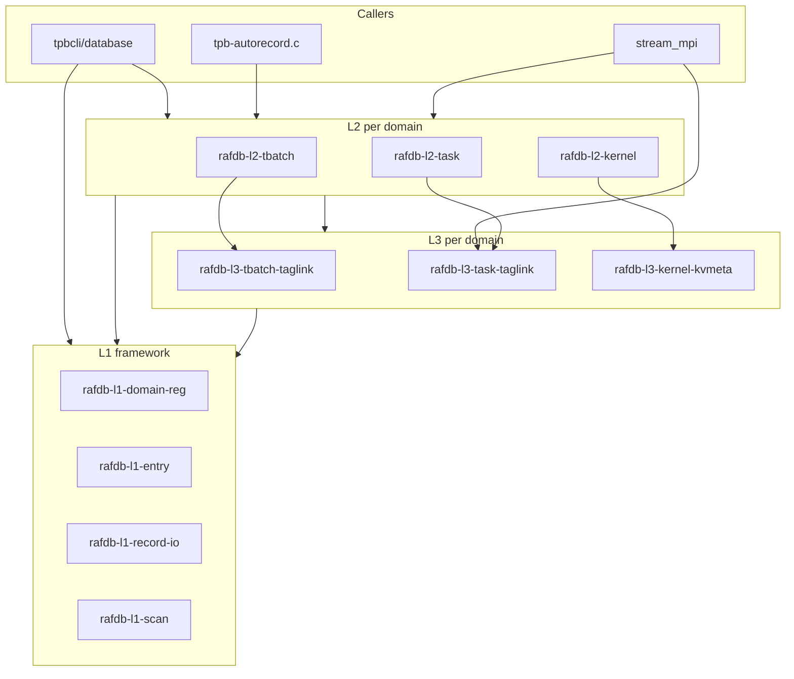

# TPBench RAFDB Module Structure

Three-layer layout under `src/corelib/rafdb/`. Public API remains in `src/include/tpb-public.h`.

## Layer Boundary Rules

| Layer | Constraint | Examples |
|-------|------------|----------|
| **L1** | Domain-agnostic; **all cross-domain logic lives here** | magic, generic tpbe/tpbr I/O, domain registry, scan, find_record |
| **L2** | **Strictly single-domain** | `rafdb-l2-tbatch.c`, `rafdb-l2-kernel.c`, `rafdb-l2-task.c` |
| **L3** | **Strictly single-domain**; filename **must include domain** | `rafdb-l3-tbatch-taglink.c`, `rafdb-l3-task-taglink.c`, `rafdb-l3-kernel-kvmeta.c` |

Cross-domain functions (must not appear in L2/L3):

- `tpb_raf_find_record` → `rafdb-l1-record-locate.c`
- `tpb_raf_scan_records_by_id_prefix`, `tpb_raf_resolve_record_file` → `rafdb-l1-scan.c`
- Domain registry, path building → `rafdb-l1-domain-reg.c`, `rafdb-l1-record-path.c`

Single-domain decoration (even if data references other domains' IDs):

- `tpb_raf_record_append_tbatch` → `rafdb-l3-tbatch-taglink.c` (modifies tbatch `.tpbr`)
- `tpb_raf_record_append_task_capsule` → `rafdb-l3-task-taglink.c` (modifies task `.tpbr`)

## File Map

```
rafdb/
├── L1 Framework
│   rafdb-l1-types.h, rafdb-l1-internal.h
│   rafdb-l1-domain-reg.c
│   rafdb-l1-magic.c, rafdb-l1-sha1.c
│   rafdb-l1-id-util.c, rafdb-l1-workspace.c
│   rafdb-l1-entry.c, rafdb-l1-record-io.c
│   rafdb-l1-record-path.c, rafdb-l1-record-locate.c
│   rafdb-l1-scan.c
├── L2 Domain
│   rafdb-l2-tbatch.c, rafdb-l2-kernel.c, rafdb-l2-task.c
│   rafdb-l2-kernel-meta-build.c
└── L3 Decoration (per domain)
    rafdb-l3-tbatch-taglink.c
    rafdb-l3-task-taglink.c
    rafdb-l3-kernel-kvmeta.c, rafdb-l3-kernel-patch.c
```

## Dependency Flow



## Test Gates

| Phase | Tests |
|-------|-------|
| L1 IO | A4.1–3, A4.6–9 |
| L2 CRUD | A4.10–19 |
| L3 decor | A6, A7, A5 |
| Integration | C1, stream smoke, stream_mpi mpirun -np 4 (C1.4 manual) |
