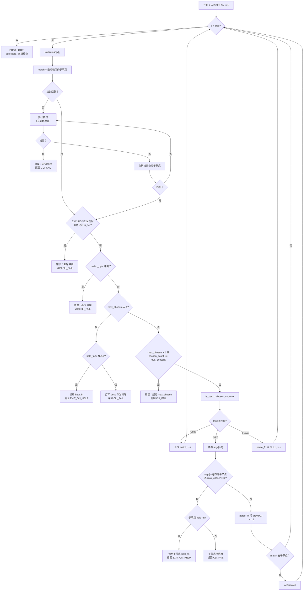

# tpbcli-argp: 基于树的 CLI 参数解析器

## 1 概述

`tpbcli-argp` 模块为 `tpbcli` 前端提供了一个基于树、栈解析的命令行参数解析器。它用结构化的语法表示、自动验证和上下文感知的帮助分发取代了临时的 `strcmp` 循环。

**核心特性：**
- 表示 CLI 语法的树形数据结构（子命令、选项、标志）
- 带自动回溯的栈式解析器
- 启发式帮助：任意位置的上下文感知 **`--help`** / **`-h`**
- 验证：必填、互斥、conflict_opts、max_chosen、预设值
- 零全局状态：所有状态都存在于调用者拥有的树中

**范围：** 模块实现（`tpbcli-argp.c/h`）与单元测试（Pack B3）。**调用方**包括 [`tpbcli.c`](../../src/tpbcli.c)（顶层子命令）与 [`tpbcli-database.c`](../../src/tpbcli-database.c)（`database`/`db` → `list`|`dump` 及 dump 选项的嵌套树）。

---

## 2 解析逻辑

### 2.1 构建参数树

调用者分两个阶段构建树：创建树句柄，然后添加节点。

**阶段一 — 创建。** `tpbcli_argtree_create("tpbcli", "TPBench CLI")` 分配树并初始化其根节点。根节点代表程序本身（深度 0）。调用者获得一个 `tpbcli_argtree_t *` 句柄。

**阶段二 — 添加节点。** 每次调用 `tpbcli_add_arg` 都会在给定父节点下追加一个子节点。所有节点属性 —— 名称、短名称、描述、类型、标志、max_chosen、回调、预设值、conflict_opts 名称和用户数据 —— 都在创建时通过 `tpbcli_argconf_t` 结构体提供。调用此函数后节点即被**封存**：

- **无重复名称。** 如果同一父节点下已存在相同 `name` 的子节点，`tpbcli_add_arg` 返回 NULL 且不添加该节点。
- **无创建后修改。** 没有 setter API。所有属性在创建时即定稿。

选择性冲突通过 `conflict_opts` 中的**兄弟节点名称字符串**（而非指针）指定，因为添加节点时目标节点可能尚未存在。解析器在解析时将这些名称解析为兄弟节点间的指针。如果无法解析名称，`tpbcli_parse_args` 返回 `TPBE_CLI_FAIL` 并附带诊断信息。

**按节点类型的结构约束：**

| 类型 | 描述 | 栈行为 | 值消耗 |
|------|-------------|----------------|-------------------|
| `TPBCLI_ARG_CMD` | 子命令（如 `run`、`benchmark`） | 匹配时入栈 | 否 |
| `TPBCLI_ARG_OPT` | 选项（如 `--kernel`） | 有子节点时入栈 | 是（下一个标记） |
| `TPBCLI_ARG_FLAG` | 布尔标志（如主名 `--help`、短名 `-h`） | 永不入栈 | 否 |

**标志语义：**

- `TPBCLI_ARGF_EXCLUSIVE` — 当即将选择 `EXCLUSIVE` 节点时，如果**任何其他**兄弟节点（无论其标志如何）已 `is_set`，则拒绝。这是"该深度仅能选择一个"的约束。示例：`run` 是互斥的；如果选择了 `run`，之后不能选择其他深度 1 的兄弟节点，反之亦然。
- `TPBCLI_ARGF_MANDATORY` — 父节点要求此子节点被设置（或有预设）。必填验证**推迟到 POST-LOOP**：在所有标记消耗完毕后，解析器遍历栈并在每一层级检查必填子节点。在 pop-retry 期间**不**检查必填（见 2.2 节第 3 步）。这确保解析器产生最相关的错误（如互斥冲突），而非在用户的真正错误在更高层级时产生误导性的"缺少必填"。
- `TPBCLI_ARGF_PRESET` — 节点具有默认值。用户未指定的必填 + 预设节点在 POST-LOOP 必填检查中不算错误。

**选择性冲突（`conflict_opts`）：** 对于仅与特定兄弟节点（而非全部）冲突的非互斥节点，`tpbcli_argconf_t` 中的 `conflict_opts` 字段列出兄弟节点名称。示例：`-P` 与 `-F` 冲突但不与 `--timer` 冲突。这比 `EXCLUSIVE` 更细粒度。冲突**默认是单向的**：如果仅 `-P` 在其 `conflict_opts` 中列出 `-F`，则在 `-F` 之后选择 `-P` 被阻止，但在 `-P` 之后选择 `-F` 是允许的。要实现双向阻止，调用者必须配置双方。

**max_chosen 语义：**

| 值 | 行为 |
|-------|----------|
| `0` | **特殊节点。** 在帮助中可见但不能正常选择。如果 `help_fn != NULL`：**帮助触发** —— 调用 `help_fn` 并返回 `TPBE_EXIT_ON_HELP`。如果 `help_fn == NULL`：**已弃用** —— 打印 `desc` 作为指导并返回 `TPBE_CLI_FAIL`。 |
| `1` | 可选一次（必须由调用者显式设置）。 |
| `N > 1` | 最多可选 N 次。 |
| `-1` | 无限制。 |

**帮助节点。** 解析器中没有硬编码的帮助拦截。相反，帮助通过带有 `max_chosen=0` 和 `help_fn` 的常规 FLAG 节点实现。**约定：** 使用 **`.name = "--help"`**、**`.short_name = "-h"`**，使生成的帮助行以长选项形式列在前面。调用者在需要上下文感知的每个节点下添加一个此类 FLAG。模块导出 `tpbcli_default_help(node, out)` —— 使用 `_sf_emit_help` 打印 `node->parent` 默认帮助。标准行为设 `.help_fn = tpbcli_default_help`（亦可自定义，如 `tpbcli database --help`）。

**互斥不阻止自身重选。** 互斥检查仅扫描其他兄弟节点，而非匹配的节点本身。自身重选由 `max_chosen` 处理。示例：`tpbcli run run` —— 第二个 `run` 弹出到根节点，再次匹配 `run`。互斥检查：任何其他兄弟节点 is_set？否 → 通过。max_chosen：`chosen_count(1) >= max_chosen(1)` → 拒绝。

**当前 CLI 的示例树：**

```
root "tpbcli" (深度 0)
 +-- CMD "run"       (互斥，深度 1)
 |    +-- OPT "--kernel" / "-k"  (必填，max_chosen=-1, 深度 2)
 |    |    +-- OPT "--kargs"          (深度 3)
 |    |    +-- OPT "--kargs-dim"      (深度 3)
 |    |    +-- OPT "--kenvs"          (深度 3)
 |    |    +-- OPT "--kenvs-dim"      (深度 3)
 |    |    +-- OPT "--kmpiargs"       (深度 3)
 |    |    +-- OPT "--kmpiargs-dim"   (深度 3)
 |    |    +-- FLAG "--help" / "-h"   (max_chosen=0, help_fn, 深度 3)
 |    +-- OPT "--timer"          (预设="clock_gettime", 深度 2)
 |    +-- OPT "--outargs"        (深度 2)
 |    +-- FLAG "--help" / "-h"   (max_chosen=0, help_fn, 深度 2)
 +-- CMD "benchmark" (互斥，深度 1)
 |    +-- OPT "--suite"          (必填，深度 2)
 |    +-- FLAG "--help" / "-h"   (max_chosen=0, help_fn, 深度 2)
 +-- CMD "database" / "db"  (互斥，深度 1；DELEGATE_SUBCMD → `tpbcli-database.c` 内嵌套树)
 |    +-- （详见下文 —— 并非全部节点都在 `tpbcli.c`）
 +-- CMD "kernel"    (互斥，深度 1)
 |    +-- CMD "list" / "ls"      (互斥，深度 2)
 |    +-- FLAG "--help" / "-h"   (max_chosen=0, help_fn, 深度 2)
 +-- CMD "help"      (互斥，深度 1)
 +-- FLAG "--help" / "-h"        (max_chosen=0, help_fn, 深度 1)
```

**嵌套的 `database` 树**（在 `tpbcli_database` 内构建；`argv[1]` 为 `database` 或 `db`）：

```
root "tpbcli"（形式根；首个匹配的 token 为 database|db）
 +-- FLAG "--help" / "-h"   （根级，可选）
 +-- CMD "database" / "db"
 |    +-- FLAG "--help" / "-h"   （自定义 help_fn：子命令与 dump 摘要）
 |    +-- CMD "list" / "ls"      （与 dump 互斥）
 |    |    +-- FLAG "--help" / "-h"
 |    +-- CMD "dump"
 |    |    +-- FLAG "--help" / "-h"
 |    |    +-- OPT "--id"、"--tbatch-id"、… "--entry"  （conflict_opts 互斥）
```

顶层 `tpbcli.c` 仅为 `database`/`db` 注册 `TPBCLI_ARGF_DELEGATE_SUBCMD` 与派发回调；上述内层结构由 [`tpbcli-database.c`](../../src/tpbcli-database.c) 维护。

`--kernel` 是一个有子节点的 OPT。匹配时，它通过 `parse_fn` 消耗其值（内核名称）**并且**入栈，因为它有子节点。后续标记如 `--kargs` 在深度 3 匹配。当标记在深度 3 不匹配时（如 `--timer`），解析器弹出 `--kernel` 并在 `run` 下的深度 2 重试。当出现第二个 `--kernel` 时，解析器弹回深度 2，再次匹配 `--kernel`（`max_chosen=-1`），消耗新的内核名称，并再次为其子节点入栈。

**`tpbcli run --kernel stream --kargs foo=bar --timer cgt` 的解析示例：**

1. `run` → 深度 1 的 CMD 匹配，入栈。栈：`[root, run]`
2. `--kernel` → 深度 2 的 OPT 匹配，消耗 `stream`，有子节点 → 入栈。栈：`[root, run, --kernel]`
3. `--kargs` → 深度 3 的 OPT 匹配（`--kernel` 的子节点），消耗 `foo=bar`。栈不变。
4. `--timer` → 深度 3 无匹配。弹出 `--kernel`（无必填子节点）。栈：`[root, run]`。重试：`--timer` 在深度 2 匹配，消耗 `cgt`。

### 2.2 解析过程

解析使用栈来跟踪在树中的当前位置。解析器从左到右处理 argv 标记，将每个标记与栈顶节点的子节点进行匹配。

**初始化。** 根节点被推入栈。标记索引 `i` 从 1 开始（跳过 `argv[0]`）。

**对每个标记 `argv[i]`：**

1. **搜索。** 查找栈顶节点的子节点中 `name` 或 `short_name` 与标记匹配的节点。
2. **如果匹配**，按顺序执行三个验证检查（首次失败即短路 —— 剩余检查被跳过）：
    1. **exclusive：** 如果匹配节点有 `EXCLUSIVE` 标志，扫描其他兄弟节点（非自身）。如果任何其他兄弟节点已 `is_set`，则拒绝。还要检查反向：如果任何已设置的其他兄弟节点有 `EXCLUSIVE`，则拒绝。
    2. **conflict_opts：** 遍历匹配节点的 `conflict_opts`。在兄弟节点中解析每个名称。如果任何已解析的兄弟节点已 `is_set`，则拒绝。
    3. **max_chosen：** 如果 `max_chosen == 0` —— 检查 `help_fn`：如果非 NULL，调用 `help_fn(match, stderr)` 并返回 `TPBE_EXIT_ON_HELP`；如果 NULL，打印 `desc` 作为弃用指导并返回 `TPBE_CLI_FAIL`。如果 `max_chosen > 0` 且 `chosen_count >= max_chosen`，则拒绝。

    诊断信息由实现定义。唯一要求是每个消息都命名被拒绝的标记和冲突/阻止的实体。

    然后更新状态（`is_set = 1`, `chosen_count++`）并按类型分发：
    - **CMD：** 入栈，`i` 前进 1。
    - **OPT：** 查看 `argv[i+1]`。如果缺失，报错。如果 `argv[i+1]` 匹配该 OPT 的一个 `max_chosen == 0` 的子节点，处理该子节点（帮助触发或已弃用）并相应返回 —— 这就是 `--kernel -h` 无需硬编码拦截即可工作的原理。否则，调用 `parse_fn(node, argv[i+1])`。如果节点有子节点，也将其入栈。`i` 前进 2。
    - **FLAG：** 如果 `max_chosen == 0` 且有 `help_fn`，则上述已采取帮助路径。否则，如果非 NULL，调用 `parse_fn(node, NULL)`。`i` 前进 1。
3. **如果不匹配**，该标记不属于当前深度。解析器尝试弹出：
    - 弹出栈顶。（此处无必填检查 —— 必填推迟到 POST-LOOP，以便解析器能首先呈现更相关的错误如互斥冲突。）
    - 如果栈现在为空，该标记 truly 未知 —— 报错。
    - 在新栈顶的子节点中搜索该标记。如果找到，转到步骤 2（验证适用）。如果未找到，重复弹出循环。

**POST-LOOP（所有标记消耗完毕后）：**

1. **自动帮助。** 如果根节点有子节点但无子节点 `is_set`，发出根节点的帮助并返回 `TPBE_EXIT_ON_HELP`。这处理了 bare `tpbcli`（无参数）情况，无需调用者特殊处理 `argc <= 1`。
2. **必填检查。** 从顶到底遍历剩余栈。在每一层级，检查必填子节点。如果任何必填子节点未设置且无预设，报错并附带诊断信息命名缺失的选项。
3. 返回 `TPBE_SUCCESS`。

这种延迟必填方法确保解析器首先产生最相关的错误：例如，`tpbcli run benchmark` 触发"互斥冲突"（来自步骤 2）而非"缺少 --kernel"（这会产生误导，因为用户从未打算完成 `run`）。

**流程图：**



### 2.3 默认帮助输出格式

当 `help_fn` 为 NULL 时，解析器从树生成帮助。`<children summary>` 按类型分类：CMD 子节点按名称列出（如 `<run|benchmark|database>`），OPT/FLAG 子节点显示为 `[options]`。

**对于无子节点的节点（叶子节点）：**

```
<node->name>: <node->desc>
```

**对于有子节点的节点：**

```
用法：<node->name> <cmd1|cmd2|...> [options]

<node->desc>

命令：
  <name>, <short_name>    <desc>
  ...

选项：
  <name>, <short_name>    <desc>  [required]
  <name>, <short_name>    <desc>  (default: <preset_value>)
  <name>, <short_name>    <desc>  [deprecated]
  ...

使用 "<node->name> <child> -h" 获取更多信息。
```

**对于有子节点的 OPT 节点（如 `--kernel -h`），帮助使用紧凑格式（格式 A）：**

```
--kernel <value>: Kernel to run

子选项：
  --kargs <value>          Comma-separated key=value kernel arguments
  --kargs-dim <value>      Dimensional sweep for kernel arguments
  --kenvs <value>          ...
  ...
```

这显示选项自身的描述及其子节点列表 —— 因为用户在问"这个选项是什么以及在其下能做什么？"。

### 2.4 前端使用模式

以下是子应用程序（如 `tpbcli-run.c`）在未来集成中如何使用 `tpbcli-argp` 的示例（本模块中未实现）。这展示了预期的 API 易用性。

```c
#include "tpbcli-argp.h"

static int parse_kernel(tpbcli_argnode_t *node, const char *value)
{
    return tpb_driver_select_kernel(value);
}

int
tpbcli_run(int argc, char **argv)
{
    /* 1. 创建树 */
    tpbcli_argtree_t *tree = tpbcli_argtree_create("tpbcli run",
                                                    "Run benchmark kernels");
    tpbcli_argnode_t *root = &tree->root;

    /* 2. 添加节点 —— 每次调用完全配置并封存节点。
     *    max_chosen 必须显式设置（0=弃用，1=一次，-1=无限制）。 */
    tpbcli_argnode_t *kern = tpbcli_add_arg(root, &(tpbcli_argconf_t){
        .name = "--kernel", .short_name = "-k",
        .desc = "Kernel to run",
        .type = TPBCLI_ARG_OPT,
        .flags = TPBCLI_ARGF_MANDATORY,
        .max_chosen = -1,
        .parse_fn = parse_kernel,
    });

    /* 内核特定选项是 --kernel 的子节点 */
    tpbcli_add_arg(kern, &(tpbcli_argconf_t){
        .name = "--kargs",
        .desc = "Comma-separated key=value kernel arguments",
        .type = TPBCLI_ARG_OPT,
        .max_chosen = 1,
        .parse_fn = parse_kargs,
    });
    tpbcli_add_arg(kern, &(tpbcli_argconf_t){
        .name = "--kargs-dim",
        .desc = "Dimensional sweep for kernel arguments",
        .type = TPBCLI_ARG_OPT,
        .max_chosen = 1,
        .parse_fn = parse_kargs_dim,
    });

    /* Run 级选项 —— conflict_opts 示例：-P 与 -F 冲突 */
    tpbcli_add_arg(root, &(tpbcli_argconf_t){
        .name = "-P",
        .desc = "Pthread parallelism",
        .type = TPBCLI_ARG_OPT,
        .max_chosen = 1,
        .conflict_opts = (const char *[]){"-F", NULL},
        .parse_fn = parse_p,
    });

    tpbcli_add_arg(root, &(tpbcli_argconf_t){
        .name = "--timer",
        .desc = "Timer backend",
        .type = TPBCLI_ARG_OPT,
        .flags = TPBCLI_ARGF_PRESET,
        .max_chosen = 1,
        .preset_value = "clock_gettime",
        .parse_fn = parse_timer,
    });

    /* 帮助节点 —— max_chosen=0 且 help_fn = tpbcli_default_help。
     * tpbcli_default_help 打印 node->parent 的默认帮助。 */
    tpbcli_add_arg(root, &(tpbcli_argconf_t){
        .name = "-h", .short_name = "--help",
        .desc = "Show help for this command",
        .type = TPBCLI_ARG_FLAG,
        .max_chosen = 0,
        .help_fn = tpbcli_default_help,
    });
    tpbcli_add_arg(kern, &(tpbcli_argconf_t){
        .name = "-h", .short_name = "--help",
        .desc = "Show help for --kernel options",
        .type = TPBCLI_ARG_FLAG,
        .max_chosen = 0,
        .help_fn = tpbcli_default_help,
    });

    /* 3. 解析 —— 所有验证都是自动的 */
    int err = tpbcli_parse_args(tree, argc, argv);

    /* 4. 清理 */
    tpbcli_argtree_destroy(tree);
    return err;
}
```

关键点：

- 子应用程序拥有从 `create` 到 `destroy` 的树。无全局状态。
- C99 复合字面量（`&(tpbcli_argconf_t){...}`）带指定初始化器使调用简洁。未指定字段默认为零/NULL。
- `parse_fn` 回调桥接到现有领域函数（`tpb_argp_set_kargs_tokstr`、`tpb_argp_set_timer` 等），因此采用是渐进式的。
- `tpbcli_parse_args` 之后，子应用程序可以通过 `tpbcli_find_arg` 检查节点以读取 `is_set`、`parsed_value` 或 `user_data`。

---

## 3 数据结构

所有类型都在 [`src/tpbcli-argp.h`](src/tpbcli-argp.h) 中声明。

### 3.1 枚举和标志

```c
typedef enum {
    TPBCLI_ARG_CMD,    /**< 子命令：入栈，无值 */
    TPBCLI_ARG_OPT,    /**< 选项：消耗下一个标记作为值 */
    TPBCLI_ARG_FLAG    /**< 布尔标志：不消耗值 */
} tpbcli_arg_type_t;

#define TPBCLI_ARGF_EXCLUSIVE   (1u << 0)  /**< 仅一个互斥兄弟 */
#define TPBCLI_ARGF_MANDATORY   (1u << 1)  /**< 父节点要求此子节点 */
#define TPBCLI_ARGF_PRESET      (1u << 2)  /**< 有默认值 */
```

### 3.2 回调签名

```c
typedef void (*tpbcli_arg_help_fn)(const tpbcli_argnode_t *node,
                                   FILE *out);
typedef int  (*tpbcli_arg_parse_fn)(tpbcli_argnode_t *node,
                                    const char *value);
```

- `help_fn(node, out)` — 将 `node` 的帮助打印到文件流 `out`（通常是 `stderr`）。如果为 NULL，解析器从树生成默认帮助。`node` 指针是 const；函数不得修改树。
- `parse_fn(node, value)` — 在解析过程中匹配 `node` 时调用。对于 OPT 节点，`value` 是下一个 argv 标记（永不为 NULL）。对于 FLAG 节点，`value` 为 NULL。成功时返回 0。任何非零返回导致 `tpbcli_parse_args` 返回 `TPBE_CLI_FAIL`。回调可以将结果存储在 `node->user_data`（在节点创建时设置）或其自己的外部状态中。

### 3.3 配置结构体

```c
typedef struct tpbcli_argconf {
    const char             *name;          /**< 主名称，如 "--kernel" */
    const char             *short_name;    /**< 别名，如 "-k"（或 NULL） */
    const char             *desc;          /**< 单行描述 */
    tpbcli_arg_type_t       type;          /**< CMD、OPT 或 FLAG */
    uint32_t                flags;         /**< EXCLUSIVE | MANDATORY | PRESET */
    int                     max_chosen;    /**< 0=弃用，1=一次，N>1=N 次，-1=无限制 */
    tpbcli_arg_parse_fn     parse_fn;      /**< 解析回调（或 NULL） */
    tpbcli_arg_help_fn      help_fn;       /**< 帮助回调（或 NULL 表示自动） */
    const char             *preset_value;  /**< 如果设置 PRESET 标志的默认值 */
    const char            **conflict_opts; /**< 以 NULL 结尾的冲突兄弟名称数组 */
    void                   *user_data;     /**< 不透明指针，传递到节点 */
} tpbcli_argconf_t;
```

`max_chosen` 必须由调用者显式设置。`0` 表示节点**已弃用**：它出现在帮助输出中（标记为 `[deprecated]`），但选择它会打印 `desc` 作为指导并返回 `TPBE_CLI_FAIL`。如果调用者在 C99 复合字面量中省略 `max_chosen`，它零初始化为 0（弃用），这在测试中会立即作为显式失败显现 —— 这是为了防止静默配置错误。

`conflict_opts` 是以 NULL 结尾的 `const char *` 字符串数组，命名与此节点冲突的兄弟节点。示例：`(const char *[]){"-F", NULL}` 表示此节点不能与名为 `-F` 的兄弟节点共存。这比 `EXCLUSIVE`（阻止所有兄弟节点）更细粒度。名称在解析时在兄弟节点间解析。

### 3.4 节点结构

```c
struct tpbcli_argnode {
    /* 标识（创建时设置，不可变） */
    const char             *name;
    const char             *short_name;
    const char             *desc;
    tpbcli_arg_type_t       type;
    uint32_t                flags;
    int                     depth;         /**< 根 = 0，由 add_arg 自动设置 */
    int                     max_chosen;

    /* 树链接（创建时设置，不可变） */
    struct tpbcli_argnode  *parent;
    struct tpbcli_argnode  *first_child;
    struct tpbcli_argnode  *next_sibling;

    /* 按名称的选择性冲突（创建时设置，解析时解析） */
    const char            **conflict_opts;
    int                     conflict_count;

    /* 回调（创建时设置，不可变） */
    tpbcli_arg_help_fn      help_fn;
    tpbcli_arg_parse_fn     parse_fn;

    /* 预设（创建时设置，不可变） */
    const char             *preset_value;

    /* 解析时状态（每次解析前重置） */
    int                     is_set;        /**< 如果至少选择过一次则为 1 */
    int                     chosen_count;  /**< 到目前为止选择的次数 */
    const char             *parsed_value;  /**< 来自 argv 的最后一个值 */
    void                   *user_data;     /**< 不透明，调用者拥有 */
};
```

### 3.5 树结构

```c
struct tpbcli_argtree {
    struct tpbcli_argnode   root;
};
```

根节点是嵌入的（不是指针）。`tpbcli_argtree_create` 分配整个结构体并初始化根节点。调用者通过 `&tree->root` 访问根节点。

---

## 4 公共 API

六个公共函数，都在 [`src/tpbcli-argp.h`](src/tpbcli-argp.h) 中声明，在 [`src/tpbcli-argp.c`](src/tpbcli-argp.c) 中实现。

### 4.1 tpbcli_argtree_create

```c
tpbcli_argtree_t *tpbcli_argtree_create(const char *prog_name,
                                         const char *prog_desc);
```

**目的。** 分配并初始化新的参数树。

**参数。**

- `prog_name` — 帮助输出中显示的程序名称（如 `"tpbcli"`）。借用；调用者必须在 `destroy` 之前保持其有效。不得为 NULL。
- `prog_desc` — 帮助输出的单行程序描述。借用。可以为 NULL。

**返回值。** 新分配的 `tpbcli_argtree_t` 指针，或分配失败时为 NULL。根节点初始化为 `name = prog_name`, `desc = prog_desc`, `depth = 0`, `type = TPBCLI_ARG_CMD`, `max_chosen = 1`。所有其他根字段清零。

**头文件依赖。** [`src/tpbcli-argp.h`](src/tpbcli-argp.h) 包含 [`src/include/tpb-public.h`](src/include/tpb-public.h) 以获取错误码定义（`TPBE_SUCCESS`、`TPBE_CLI_FAIL`、`TPBE_EXIT_ON_HELP` 等）。这与所有其他 `src/*.c` 文件一致。

**内存。** 返回的指针必须由 `tpbcli_argtree_destroy` 释放。

### 4.2 tpbcli_argtree_destroy

```c
void tpbcli_argtree_destroy(tpbcli_argtree_t *tree);
```

**目的。** 释放树及 `tpbcli_add_arg` 创建的所有节点。

**参数。**

- `tree` — 来自 `tpbcli_argtree_create` 的树句柄。如果为 NULL，函数无操作。

**内存。** 递归释放 `tpbcli_add_arg` 分配的每个 `tpbcli_argnode_t`（子 - 兄弟遍历），然后释放 `tpbcli_argtree_t` 本身。**不**释放任何调用者拥有的指针：`name`、`short_name`、`desc`、`preset_value`、`conflict_opts`、`user_data`。这些是借用引用，其生命周期由调用者负责。

### 4.3 tpbcli_add_arg

```c
tpbcli_argnode_t *tpbcli_add_arg(tpbcli_argnode_t *parent,
                                  const tpbcli_argconf_t *conf);
```

**目的。** 在 `parent` 下使用 `conf` 的配置创建新的子节点。调用此函数后节点即被封存 —— 其属性无法更改。

**参数。**

- `parent` — 父节点。不得为 NULL。通常是 `&tree->root` 或先前返回的节点指针。
- `conf` — 配置结构体。不得为 NULL。结构体仅读取一次；指针本身不存储。`conf` 内的所有 `const char *` 字段都是**借用**的（模块不复制字符串）。调用者必须确保它们的生命周期超过树。`conf->name` 不得为 NULL。

**返回值。** 新创建的封存节点指针，或失败时为 NULL。失败发生在：

- `parent` 或 `conf` 为 NULL，或 `conf->name` 为 NULL。
- 父节点下已存在相同 `name` 的子节点（重复拒绝）。
- `malloc` 失败。

**行为。**

- 堆分配 `tpbcli_argnode_t` 并从 `conf` 复制所有字段。
- 设置 `depth = parent->depth + 1`。
- `max_chosen` 原样从 `conf` 存储。`0` = 弃用（无标准化）。
- 如果 `conf->conflict_opts` 非 NULL，计数直到第一个 NULL 终止符的条目数并将计数存储在 `conflict_count` 中。
- 将新节点附加为 `parent` 的**最后一个**子节点（在帮助输出中保留插入顺序）。
- 解析时字段（`is_set`、`chosen_count`、`parsed_value`）初始化为零/NULL。

**错误报告。** 返回 NULL。不打印诊断信息（调用者检查返回值）。

### 4.4 tpbcli_parse_args

```c
int tpbcli_parse_args(tpbcli_argtree_t *tree,
                       int argc, char **argv);
```

**目的。** 使用 2.2 节描述的基于栈的算法解析 `argv`。

**参数。**

- `tree` — 树句柄。不得为 NULL。
- `argc` — 参数计数（与 `main` 相同）。
- `argv` — 参数向量（与 `main` 相同）。跳过 `argv[0]`。

**返回值。**

- `TPBE_SUCCESS` (0) — 所有标记解析完毕，所有必填检查通过。
- `TPBE_EXIT_ON_HELP` — 匹配了帮助节点（`max_chosen=0` 且有 `help_fn`），或触发 POST-LOOP 自动帮助（未选择子应用程序）。帮助已打印到 `stderr`。不是错误；调用者应干净退出。
- `TPBE_CLI_FAIL` — 解析错误。诊断消息已打印到 `stderr`。

**解析前初始化。** 在主循环之前，解析器递归重置所有节点上的 `is_set`、`chosen_count` 和 `parsed_value`（以便必要时可重新解析树）。它还将 `conflict_opts` 名称解析为兄弟节点指针并验证它们；无法解析的名称导致立即 `TPBE_CLI_FAIL`。

**副作用。** 修改匹配节点上的解析时字段（`is_set`、`chosen_count`、`parsed_value`）。调用 `parse_fn` 回调，可能会有任意副作用。将诊断和帮助打印到 `stderr`。

### 4.5 tpbcli_find_arg

```c
int tpbcli_find_arg(const tpbcli_argnode_t *start,
                     const char *name,
                     int offset,
                     tpbcli_argnode_t **out);
```

**目的。** 在 rooted at `start` 的子树中搜索深度恰好为 `start->depth + offset` 且 `name` 或 `short_name` 匹配的节点。

**参数。**

- `start` — 要搜索的子树的根。不得为 NULL。
- `name` — 要与 `node->name` 和 `node->short_name` 匹配的名称。不得为 NULL。
- `offset` — 从 `start` 的深度偏移量。必须 >= 0。如果为 0，检查 `start` 本身。如果为 1，检查直接子节点。如果为 2，检查孙子节点，依此类推。
- `out` — 输出指针。成功时，`*out` 设置为匹配节点。失败时，`*out` 设置为 NULL。不得为 NULL。

**前提条件强制。** 违反 `start != NULL`、`name != NULL`、`out != NULL`、`offset >= 0` 是编程错误。函数使用 `assert()` 快速失败。这些不是用户输入错误，在正确代码中应永远不会发生。

**返回值。** 如果找到则返回 `TPBE_SUCCESS` (0)，如果在指定深度未找到匹配则返回 `TPBE_LIST_NOT_FOUND`。

**搜索顺序。** 深度优先，从左到右（遵循 `first_child` 然后 `next_sibling` 链接）。返回第一个匹配。

### 4.6 tpbcli_default_help

```c
void tpbcli_default_help(const tpbcli_argnode_t *node, FILE *out);
```

**目的。** 用作 `-h`/`--help` FLAG 节点上 `help_fn` 的便捷函数。使用与 `_sf_emit_help` 相同的格式打印 `node->parent` 的默认帮助。如果 `node->parent` 为 NULL（根级别），则打印 `node` 本身的帮助。

**参数。**

- `node` — 匹配的帮助节点（通常是 `-h` FLAG）。不得为 NULL。
- `out` — 输出流（通常是 `stderr`）。

**用法。** 调用者在添加 `-h`/`--help` 节点时设置 `.help_fn = tpbcli_default_help`：

```c
tpbcli_add_arg(parent, &(tpbcli_argconf_t){
    .name = "-h", .short_name = "--help",
    .type = TPBCLI_ARG_FLAG,
    .max_chosen = 0,
    .help_fn = tpbcli_default_help,
});
```

想要自定义帮助的调用者可以提供自己的 `help_fn`。

---

## 5 内存模型

- **模块分配：** `tpbcli_argtree_t`（通过 `create`）和每个 `tpbcli_argnode_t`（通过 `add_arg`）。
- **模块释放：** 以上所有内容（通过 `destroy`），使用递归子 - 兄弟遍历。
- **调用者拥有：** 所有 `const char *` 字符串（`name`、`short_name`、`desc`、`preset_value`）、`conflict_opts` 数组和 `user_data` 指针。这些是借用引用。调用者必须确保它们在树的生命周期内保持有效。字符串字面量 trivially 满足此要求。
- **无全局状态：** 模块中没有静态或全局变量。所有状态都存在于树及其节点中。模块在单独树上并发使用是安全的。
- **重新解析安全：** `tpbcli_parse_args` 在解析前重置所有解析时状态。树可以被解析多次（如用于测试）。

---

## 6 文件

### 6.1 新文件

| 文件 | 目的 |
|------|---------|
| [`src/tpbcli-argp.h`](src/tpbcli-argp.h) | 公共头文件：所有类型、配置结构体、带 Doxygen 文档的 6 个 API 原型 |
| [`src/tpbcli-argp.c`](src/tpbcli-argp.c) | 实现：树生命周期、带封存/去重的 add_arg、栈解析器、find_arg、默认帮助生成器、验证检查 |
| [`tests/tpbcli/test_tpbcli_argp.c`](tests/tpbcli/test_tpbcli_argp.c) | 单元测试包 B3（10 个测试用例） |

### 6.2 修改的文件

| 文件 | 变更 |
|------|--------|
| [`CMakeLists.txt`](CMakeLists.txt) | 将 `src/tpbcli-argp.c` 添加到 `tpbcli` 可执行文件源列表 |
| [`tests/tpbcli/CMakeLists.txt`](tests/tpbcli/CMakeLists.txt) | 添加 `test-tpbcli-argp` 可执行文件（直接编译 `src/tpbcli-argp.c`，包 B3，10 个测试用例），添加到 `test_tpbcli` 依赖 |

**构建模式。** 测试遵循与包 B1（`test-cli-run-dimargs`）相同的方法：直接将 `src/*.c` 文件编译到测试可执行文件中，并链接 `tpbench` 以获取错误码。无需 corelib CMake 变更。

---

## 7 测试计划 — 包 B3

测试文件 [`tests/tpbcli/test_tpbcli_argp.c`](tests/tpbcli/test_tpbcli_argp.c) 定义了自己的本地 `test_case_t` 和 `run_pack`（与 [`tests/corelib/mock_kernel.h`](tests/corelib/mock_kernel.h) 相同模式），因此它对 corelib 测试 mocks 零依赖。仅链接 `tpbench`。标签：`tpbcli`。

**整合理由。** 测试按语义区域组织，而非按单个特性。每个测试构建自己的树，并可能运行多个解析场景以覆盖相关路径，而无需重复设置。

| 用例 | 名称 | 涵盖场景 |
|------|------|-------------------|
| B3.1 | `tree_lifecycle` | (a) `create` 返回非 NULL，根字段正确（`name`、`depth=0`、`type=CMD`）。(b) 添加 3 个 CMD 子节点，验证 `first_child`、兄弟链、`parent` 回指、`depth=1`。(c) 在同一父节点下添加重复名称 → 返回 NULL，原始节点不受影响。(d) 在填充的树上 `destroy` → 无崩溃。(e) `destroy(NULL)` → 无崩溃。 |
| B3.2 | `parse_basic` | 构建树：root → CMD "run" → OPT "--kernel"（带子节点 OPT "--kargs"）+ OPT "--timer"。(a) `argv = {"prog", "run", "--kernel", "stream", "--kargs", "n=10"}`。验证 `TPBE_SUCCESS`、`run->is_set`、`--kernel` `parsed_value == "stream"`、`--kargs` `parsed_value == "n=10"`、`parse_fn` 以正确值调用。(b) 验证每个匹配节点上 `chosen_count == 1`。 |
| B3.3 | `mandatory_and_preset` | 构建树：root → CMD "run" → OPT "--kernel"（必填）+ OPT "--timer"（必填 + 预设 = "cgt"）。(a) `argv = {"prog", "run"}` — 缺少 "--kernel" → `TPBE_CLI_FAIL`。(b) `argv = {"prog", "run", "--kernel", "s"}` — "--kernel" 已设置，"--timer" 有预设 → `TPBE_SUCCESS`，`--timer` `is_set == 0`。 |
| B3.4 | `exclusive_conflict` | 构建树：root → CMD "run"（互斥）+ CMD "benchmark"（互斥）。`argv = {"prog", "run", "benchmark"}`。"benchmark" 在 "run" 下不匹配，解析器弹出，在深度 1 找到 "benchmark" 但 "run" 已设置且互斥 → `TPBE_CLI_FAIL`。 |
| B3.5 | `conflict_opts` | 构建树：root → CMD "run" → OPT "-P"（conflict_opts={"-F", NULL}）+ OPT "-F"（conflict_opts={"-P", NULL}）+ OPT "--timer"。`argv = {"prog", "run", "-P", "4", "-F", "x"}`。第二个选项触发 conflict_opts 错误 → `TPBE_CLI_FAIL`。还要验证 `-P` 和 `--timer` 共存无错误（conflict_opts 是选择性的，不是全面互斥）。 |
| B3.6 | `help_dispatch` | 构建树：root → CMD "run" → OPT "--kernel"（带子节点 OPT "--kargs"）。在 root 下、"run" 下和 "--kernel" 下添加 FLAG "-h"（max_chosen=0, help_fn=test 回调，设置标志）。(a) `argv = {"prog", "-h"}` → `-h` 在 root 下匹配且 max_chosen=0 + help_fn → `TPBE_EXIT_ON_HELP`，root 级帮助标志设置。(b) 重新解析：`argv = {"prog", "run", "--kernel", "-h"}` → OPT "--kernel" 查看 "-h"，找到 max_chosen=0 + help_fn 的子节点 → `TPBE_EXIT_ON_HELP`，kernel 级帮助标志设置（非 root 的）。(c) 重新解析：`argv = {"prog"}`（bare，无参数）→ POST-LOOP 自动帮助 → `TPBE_EXIT_ON_HELP`。 |
| B3.7 | `unknown_arg` | 构建树：root → CMD "run"。`argv = {"prog", "--bogus"}`。无子节点匹配，栈耗尽 → `TPBE_CLI_FAIL`。 |
| B3.8 | `stack_pop_retry` | 构建树：root → CMD "run" → OPT "--kernel"（max_chosen=-1，带子节点 OPT "--kargs"）+ OPT "--timer"。(a) `argv = {"prog", "run", "--kernel", "s", "--kargs", "n=1", "--timer", "t"}`。解析器在 "--timer" 上弹出 "--kernel"，在深度 2 重试，成功。验证所有三个选项解析。(b) `argv = {"prog", "run", "--kernel", "a", "--kargs", "x=1", "--kernel", "b", "--kargs", "y=2"}`。第二个 "--kernel" 弹回深度 2 并重新匹配。验证 `--kernel` `chosen_count == 2`。 |
| B3.9 | `max_chosen` | 使用单独树的三个场景：(a) **已弃用。** 构建树：root → CMD "run" → OPT "--old"（max_chosen=0, desc="use --new instead"）。`argv = {"prog", "run", "--old", "v"}` → `TPBE_CLI_FAIL`（打印弃用指导）。(b) **超过。** 构建树：root → CMD "run"（互斥，max_chosen=1）。`argv = {"prog", "run", "run"}`。第二个 "run" 弹出到 root，再次匹配但 `chosen_count >= 1` → `TPBE_CLI_FAIL`。(c) **无限制。** 用 `max_chosen=-1` 重建。相同 argv → `TPBE_SUCCESS`，`chosen_count == 2`。 |
| B3.10 | `find_arg` | 构建 3 级树：root → CMD "a" → OPT "leaf"。(a) `find_arg(&root, "leaf", 2, &out)` → `TPBE_SUCCESS`，`out->name == "leaf"`。(b) `find_arg(&root, "leaf", 1, &out)` → `TPBE_LIST_NOT_FOUND`。(c) `find_arg(&root, "a", 1, &out)` → `TPBE_SUCCESS`。 |

---

## 8 tpbcli-argp.c 中的静态函数

遵循风格指南（单文件静态使用 `_sf_` 前缀）：

| 函数 | 目的 |
|----------|---------|
| `_sf_find_child(parent, token)` | 线性扫描 `parent->first_child` 兄弟链。返回第一个 `name` 或 `short_name` 匹配 `token` 的子节点，或 NULL。 |
| `_sf_find_child_by_name(parent, name)` | 与上述相同，但仅匹配 `name` 字段（排除 `short_name`）。用于 conflict_opts 名称解析。 |
| `_sf_find_max_chosen_zero_child(opt, token)` | 搜索 `opt` 的子节点，查找 `max_chosen==0` 且 `name` 或 `short_name` 匹配 `token` 的子节点。用于 OPT 查看逻辑，在将 `argv[i+1]` 作为值消耗之前拦截帮助/已弃用节点。 |
| `_sf_sibling_exclusive_conflict(match)` | 遍历 `match` 的兄弟节点（通过 `match->parent->first_child` 链）。如果 `match` 有 `EXCLUSIVE` 标志且任何其他兄弟节点已 `is_set`，返回该冲突的兄弟节点。如果任何已 `is_set` 的兄弟节点有 `EXCLUSIVE` 标志，返回它。否则返回 NULL。 |
| `_sf_sibling_conflict_opts_hit(match)` | 遍历 `match->conflict_opts[0..conflict_count-1]`。通过 `_sf_find_child_by_name(match->parent, name)` 在兄弟节点中解析每个名称。如果任何已解析的兄弟节点 `is_set`，返回它。否则返回 NULL。 |
| `_sf_validate_pre_increment(match, out)` | 按顺序执行三个验证检查：(1) 互斥冲突，(2) conflict_opts 冲突，(3) max_chosen（帮助/已弃用/超过）。如果任何检查失败，打印诊断并返回 `TPBE_CLI_FAIL` 或 `TPBE_EXIT_ON_HELP`；如果全部通过，返回 `TPBE_SUCCESS`。 |
| `_sf_resolve_conflict_opts_validate(root)` | 解析前验证遍历：递归遍历所有节点。对于每个有 `conflict_opts` 的节点，验证每个名称解析为有效的兄弟节点。如果任何名称无法解析（附带到 stderr 的诊断），返回 `TPBE_CLI_FAIL`。 |
| `_sf_emit_help(node, out)` | 打印 `node` 的默认帮助。对于 CMD 或根节点：分类格式（用法行带 `<cmd1|cmd2|...> [options]`、desc、Commands 部分、Options 部分）。对于有子节点的 OPT 节点：紧凑格式 A（`<name> <value>: <desc>`，然后 `Sub-options:` 部分）。对于叶子节点：`<name>: <desc>`。`max_chosen=0` 且 `help_fn==NULL` 的节点在列表中标记为 `[deprecated]`。此函数**就是**默认帮助生成器；`tpbcli_default_help` 在 `node->parent` 上调用此函数。 |
| `_sf_reset_parse_state(node)` | 递归重置 `node` 及其所有后代上的 `is_set`、`chosen_count` 和 `parsed_value` 为零/NULL。每次解析前调用。 |
| `_sf_destroy_children(node)` | 递归释放 `node` 的所有子节点（深度优先：先释放每个子节点的子树，然后释放子节点本身）。不释放 `node` 本身。 |
| `_sf_mandatory_fail(parent, out)` | 检查 `parent` 的必填子节点。打印第一个缺失必填子节点（无预设）的诊断并返回 `TPBE_CLI_FAIL`。 |
| `_sf_post_loop(tree, stack, stack_sz, out)` | POST-LOOP 处理程序：(1) 如果根节点有子节点但无子节点 `is_set` 则自动帮助，(2) 从顶到底对所有栈层级进行必填检查。 |
| `_sf_find_arg_dfs(node, target_depth, name, out)` | `tpbcli_find_arg` 的 DFS 辅助函数。查找在 `target_depth` 且匹配 `name` 或 `short_name` 的第一个节点。找到则返回 `TPBE_SUCCESS`，否则返回 `TPBE_LIST_NOT_FOUND`。 |
| `_sf_child_name_exists(parent, name)` | 检查 `parent` 下是否已存在 `name` 的子节点。`tpbcli_add_arg` 用于重复拒绝。 |

---

## 9 错误码

模块使用来自 [`src/include/tpb-public.h`](src/include/tpb-public.h) 的错误码：

| 码 | 值 | 用法 |
|------|-------|-------|
| `TPBE_SUCCESS` | 0 | 成功 |
| `TPBE_EXIT_ON_HELP` | 1 | 已显示帮助；调用者应退出 |
| `TPBE_CLI_FAIL` | 2 | 解析错误；已打印诊断 |
| `TPBE_LIST_NOT_FOUND` | 8 | `tpbcli_find_arg` 在指定深度未找到匹配 |

---

## 10 设计原理

### 10.1 基于树的语法与扁平选项列表

传统 CLI 解析器（如 getopt、glibc 的 argp）使用带可选子命令处理的扁平选项列表。`tpbcli-argp` 中的树方法提供：

- **上下文感知帮助：** 每个节点可以有自己的帮助输出，仅显示相关子节点。
- **嵌套验证：** 必填/互斥/冲突检查适用于每个深度级别。
- **自动回溯：** 基于栈的解析器处理深度嵌套结构，无需手动状态管理。

### 10.2 max_chosen = 0 用于帮助/已弃用

使用 `max_chosen = 0` 作为特殊标记（而非单独的 `is_help` 标志）简化了 API：

- 调用者显式设置 `max_chosen` —— 无意外零初始化为"可选一次"。
- 同一字段处理帮助触发（`help_fn != NULL`）和已弃用选项（`help_fn == NULL`）。
- 帮助输出可以基于此单字段将节点标记为 `[deprecated]`。

### 10.3 延迟必填验证

必填检查推迟到 POST-LOOP 而非在解析期间强制：

- **更好的错误消息：** 如果用户输入 `tpbcli run benchmark`，解析器报告"互斥冲突"（实际错误）而非"缺少 --kernel"（这会产生误导）。
- **完整验证：** 在所有命令理解完毕后一起检查所有必填要求。

### 10.4 借用字符串指针

模块不复制字符串 —— 它存储指向调用者拥有内存的指针：

- **零分配开销：** 选项名称、描述或值无需 `strdup` 调用。
- **调用者控制：** 调用者可以使用字符串字面量、静态缓冲区或动态分配的字符串，只要它们的生命周期超过树。
- **清晰的拥有权：** API 文档明确说明哪些指针是借用的 vs. 拥有的。

---

## 11 未来扩展

初始实现中未包含的潜在增强：

- **短选项组合：** 对单字符标志支持 `-abc` 作为 `--a --b --c`。
- **必选参数：** 支持位置参数（如 `tpbcli <command> <input-file>`）。
- **自定义验证器：** 允许 `parse_fn` 返回结构化错误码以提供更丰富的诊断。
- **JSON/YAML 树导出：** 序列化参数树以生成文档。
