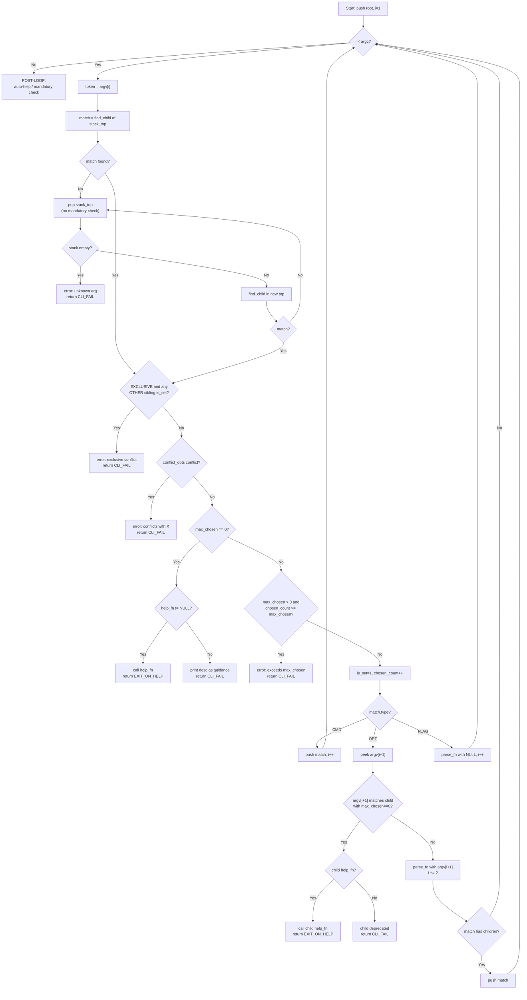

# tpbcli-argp: Tree-Based CLI Argument Parser

## 1 Overview

The `tpbcli-argp` module provides a tree-based, stack-parsed command-line argument parser for the `tpbcli` frontend. It replaces ad-hoc `strcmp` loops with a structured grammar representation, automatic validation, and context-sensitive help dispatch.

**Key features:**
- Tree data structure representing CLI grammar (subcommands, options, flags)
- Stack-based parser with automatic backtracking
- Heuristic help: context-sensitive `-h/--help` at any position
- Validation: mandatory, exclusive, conflict_opts, max_chosen, preset-value
- Zero global state: all state lives in the caller-owned tree

**Scope:** Module implementation and unit tests only. No changes to `tpbcli.c` or any `tpbcli-*.c` frontend files.

---

## 2 Parsing Logic

### 2.1 Building the Parameter Tree

The caller constructs a tree in two phases: create the tree handle, then add nodes.

**Phase 1 — Create.** `tpbcli_argtree_create("tpbcli", "TPBench CLI")` allocates the tree and initializes its root node. The root represents the program itself (depth 0). The caller receives a `tpbcli_argtree_t *` handle.

**Phase 2 — Add nodes.** Each call to `tpbcli_add_arg` appends one child node under a given parent. All node attributes — name, short name, description, type, flags, max_chosen, callbacks, preset value, conflict_opts names, and user data — are supplied at creation time through a `tpbcli_argconf_t` struct. The node is **sealed** after this call:

- **No duplicate names.** If a child with the same `name` already exists under the same parent, `tpbcli_add_arg` returns NULL and does not add the node.
- **No post-creation modification.** There is no setter API. All attributes are finalized at creation.

Selective conflicts are specified by **sibling name strings** in `conflict_opts` (not pointers), because partner nodes may not exist yet when a node is added. The parser resolves these names to node pointers among siblings at parse time. If a name cannot be resolved, `tpbcli_parse_args` returns `TPBE_CLI_FAIL` with a diagnostic.

**Structural constraints per node type:**

| Type | Description | Stack Behavior | Value Consumption |
|------|-------------|----------------|-------------------|
| `TPBCLI_ARG_CMD` | Subcommand (e.g., `run`, `benchmark`) | Pushed when matched | No |
| `TPBCLI_ARG_OPT` | Option (e.g., `--kernel`) | Pushed if has children | Yes (next token) |
| `TPBCLI_ARG_FLAG` | Boolean flag (e.g., `-h`) | Never pushed | No |

**Flag semantics:**

- `TPBCLI_ARGF_EXCLUSIVE` — When an `EXCLUSIVE` node is about to be selected, if **any** other sibling (regardless of its flags) is already `is_set`, reject. This is the "only one at this depth" constraint. Example: `run` is exclusive; if `run` is selected, no other depth-1 sibling can be selected afterward, and vice versa.
- `TPBCLI_ARGF_MANDATORY` — Parent requires this child to be set (or have a preset). Mandatory validation is **deferred to the POST-LOOP**: after all tokens are consumed, the parser walks the stack and checks mandatory children at each level. Mandatory is NOT checked during pop-retry (see Section 2.2 Step 3). This ensures that the parser produces the most relevant error (e.g., exclusive conflict) rather than a misleading "missing mandatory" when the user's real mistake is at a higher level.
- `TPBCLI_ARGF_PRESET` — The node has a default value. A mandatory+preset node that the user does not specify is not an error during the POST-LOOP mandatory check.

**Selective conflict (`conflict_opts`):** For non-exclusive nodes that only conflict with specific siblings (not all), the `conflict_opts` field in `tpbcli_argconf_t` lists sibling names. Example: `-P` conflicts with `-F` but not with `--timer`. This is finer-grained than `EXCLUSIVE` (which blocks ALL siblings). Conflicts are **one-directional by default**: if only `-P` lists `-F` in its `conflict_opts`, then selecting `-P` after `-F` is blocked, but selecting `-F` after `-P` is allowed. For bidirectional blocking, the caller must configure both sides.

**max_chosen semantics:**

| Value | Behavior |
|-------|----------|
| `0` | **Special node.** Visible in help but cannot be normally selected. If `help_fn != NULL`: **help trigger** — calls `help_fn` and returns `TPBE_EXIT_ON_HELP`. If `help_fn == NULL`: **deprecated** — prints `desc` as guidance and returns `TPBE_CLI_FAIL`. |
| `1` | Selectable once (must be set explicitly by the caller). |
| `N > 1` | Selectable up to N times. |
| `-1` | Unlimited. |

**Help nodes.** There is no hardcoded `-h`/`--help` intercept in the parser. Instead, help is implemented via regular FLAG nodes with `max_chosen=0` and a `help_fn`. The caller adds `-h`/`--help` as children of each node that should support help. The module exports `tpbcli_default_help(node, out)` — a convenience function that prints default help for `node->parent` using `_sf_emit_help`. Callers set `.help_fn = tpbcli_default_help` for standard help behavior.

**Exclusive does NOT block self-reselection.** The exclusive check scans OTHER siblings only, not the matched node itself. Self-reselection is handled by `max_chosen`. Example: `tpbcli run run` — second `run` pops to root, matches `run` again. Exclusive check: any other sibling is_set? No → passes. max_chosen: `chosen_count(1) >= max_chosen(1)` → rejected.

**Example tree for the current CLI:**

```
root "tpbcli" (depth 0)
 +-- CMD "run"       (exclusive, depth 1)
 |    +-- OPT "--kernel" / "-k"  (mandatory, max_chosen=-1, depth 2)
 |    |    +-- OPT "--kargs"          (depth 3)
 |    |    +-- OPT "--kargs-dim"      (depth 3)
 |    |    +-- OPT "--kenvs"          (depth 3)
 |    |    +-- OPT "--kenvs-dim"      (depth 3)
 |    |    +-- OPT "--kmpiargs"       (depth 3)
 |    |    +-- OPT "--kmpiargs-dim"   (depth 3)
 |    |    +-- FLAG "-h" / "--help"   (max_chosen=0, help_fn, depth 3)
 |    +-- OPT "--timer"          (preset="clock_gettime", depth 2)
 |    +-- OPT "--outargs"        (depth 2)
 |    +-- FLAG "-h" / "--help"   (max_chosen=0, help_fn, depth 2)
 +-- CMD "benchmark" (exclusive, depth 1)
 |    +-- OPT "--suite"          (mandatory, depth 2)
 |    +-- FLAG "-h" / "--help"   (max_chosen=0, help_fn, depth 2)
 +-- CMD "database"  (exclusive, depth 1)
 |    +-- CMD "list" / "ls"      (exclusive, depth 2)
 |    +-- CMD "dump"             (exclusive, depth 2)
 |    +-- FLAG "-h" / "--help"   (max_chosen=0, help_fn, depth 2)
 +-- CMD "kernel"    (exclusive, depth 1)
 |    +-- CMD "list" / "ls"      (exclusive, depth 2)
 |    +-- FLAG "-h" / "--help"   (max_chosen=0, help_fn, depth 2)
 +-- CMD "help"      (exclusive, depth 1)
 +-- FLAG "-h" / "--help"        (max_chosen=0, help_fn, depth 1)
```

`--kernel` is an OPT with children. When matched, it consumes its value (the kernel name) via `parse_fn` AND is pushed onto the stack because it has children. Subsequent tokens like `--kargs` are matched at depth 3. When a token does not match at depth 3 (e.g., `--timer`), the parser pops `--kernel` and retries at depth 2 under `run`. When a second `--kernel` appears, the parser pops back to depth 2, matches `--kernel` again (`max_chosen=-1`), consumes the new kernel name, and pushes it again for its children.

**Parsing example for `tpbcli run --kernel stream --kargs foo=bar --timer cgt`:**

1. `run` → CMD match at depth 1, push. Stack: `[root, run]`
2. `--kernel` → OPT match at depth 2, consume `stream`, has children → push. Stack: `[root, run, --kernel]`
3. `--kargs` → OPT match at depth 3 (child of `--kernel`), consume `foo=bar`. Stack unchanged.
4. `--timer` → no match at depth 3. Pop `--kernel` (no mandatory children). Stack: `[root, run]`. Retry: `--timer` matches at depth 2, consume `cgt`.

### 2.2 Parsing Process

Parsing uses a stack to track the current position in the tree. The parser processes argv tokens left-to-right, matching each token against children of the stack-top node.

**Initialization.** The root node is pushed onto the stack. Token index `i` starts at 1 (skipping `argv[0]`).

**For each token `argv[i]`:**

1. **Search.** Look for a child of the stack-top node whose `name` or `short_name` matches the token.
2. **If matched**, run three validation checks in this order (first failure short-circuits — remaining checks are skipped):
   1. **exclusive:** If the matched node has `EXCLUSIVE` flag, scan OTHER siblings (not self). If any other sibling is already `is_set`, reject. Also check the reverse: if any already-set other sibling has `EXCLUSIVE`, reject.
   2. **conflict_opts:** Walk the matched node's `conflict_opts`. Resolve each name among siblings. If any resolved sibling is already `is_set`, reject.
   3. **max_chosen:** If `max_chosen == 0` — check `help_fn`: if non-NULL, call `help_fn(match, stderr)` and return `TPBE_EXIT_ON_HELP`; if NULL, print `desc` as deprecation guidance and return `TPBE_CLI_FAIL`. If `max_chosen > 0` and `chosen_count >= max_chosen`, reject.

   Diagnostics are implementation-defined. The only requirement is that each message names both the rejected token and the conflicting/blocking entity.

   Then update state (`is_set = 1`, `chosen_count++`) and dispatch by type:
   - **CMD:** push onto stack, advance `i` by 1.
   - **OPT:** peek at `argv[i+1]`. If missing, error. If `argv[i+1]` matches a child of the OPT with `max_chosen == 0`, handle that child (help trigger or deprecated) and return accordingly — this is how `--kernel -h` works without a hardcoded intercept. Otherwise, call `parse_fn(node, argv[i+1])`. If the node has children, also push it. Advance `i` by 2.
   - **FLAG:** if `max_chosen == 0` with `help_fn`, the help path was already taken above. Otherwise, call `parse_fn(node, NULL)` if non-NULL. Advance `i` by 1.
3. **If not matched**, the token does not belong at the current depth. The parser tries to pop up:
   - Pop the stack-top. (No mandatory check here — mandatory is deferred to POST-LOOP so the parser can surface more relevant errors like exclusive conflicts first.)
   - If the stack is now empty, the token is truly unknown — error.
   - Search the new stack-top's children for the token. If found, go to step 2 (validations apply there). If not found, repeat the pop loop.

**POST-LOOP (after all tokens are consumed):**

1. **Auto-help.** If the root has children but no child is `is_set`, emit help for the root and return `TPBE_EXIT_ON_HELP`. This handles the bare `tpbcli` (no arguments) case without requiring the caller to special-case `argc <= 1`.
2. **Mandatory check.** Walk the remaining stack from top to bottom. At each level, check mandatory children. If any mandatory child is unset and has no preset, error with a diagnostic naming the missing option.
3. Return `TPBE_SUCCESS`.

This deferred mandatory approach ensures the parser produces the most relevant error first: e.g., `tpbcli run benchmark` triggers "exclusive conflict" (from step 2) rather than "missing --kernel" (which would be misleading since the user never intended to complete `run`).

**Flowchart:**



### 2.3 Default Help Output Format

When `help_fn` is NULL, the parser generates help from the tree. The `<children summary>` is categorized by type: CMD children are listed by name (e.g., `<run|benchmark|database>`), OPT/FLAG children appear as `[options]`.

**For a node without children (leaf node):**

```
<node->name>: <node->desc>
```

**For a node with children:**

```
Usage: <node->name> <cmd1|cmd2|...> [options]

<node->desc>

Commands:
  <name>, <short_name>    <desc>
  ...

Options:
  <name>, <short_name>    <desc>  [required]
  <name>, <short_name>    <desc>  (default: <preset_value>)
  <name>, <short_name>    <desc>  [deprecated]
  ...

Use "<node->name> <child> -h" for more information.
```

**For an OPT node with children (e.g., `--kernel -h`), the help uses a compact format (format A):**

```
--kernel <value>: Kernel to run

Sub-options:
  --kargs <value>          Comma-separated key=value kernel arguments
  --kargs-dim <value>      Dimensional sweep for kernel arguments
  --kenvs <value>          ...
  ...
```

This shows both the option's own description and its children list — because the user is asking "what is this option and what can I do under it?".

### 2.4 Frontend Usage Pattern

Below is how a sub-app (e.g., `tpbcli-run.c`) would use `tpbcli-argp` in a future integration (not implemented in this module). This shows the intended API ergonomics.

```c
#include "tpbcli-argp.h"

static int parse_kernel(tpbcli_argnode_t *node, const char *value)
{
    return tpb_driver_select_kernel(value);
}

int
tpbcli_run(int argc, char **argv)
{
    /* 1. Create tree */
    tpbcli_argtree_t *tree = tpbcli_argtree_create("tpbcli run",
                                                    "Run benchmark kernels");
    tpbcli_argnode_t *root = &tree->root;

    /* 2. Add nodes — each call fully configures and seals the node.
     *    max_chosen MUST be set explicitly (0=deprecated, 1=once, -1=unlimited). */
    tpbcli_argnode_t *kern = tpbcli_add_arg(root, &(tpbcli_argconf_t){
        .name = "--kernel", .short_name = "-k",
        .desc = "Kernel to run",
        .type = TPBCLI_ARG_OPT,
        .flags = TPBCLI_ARGF_MANDATORY,
        .max_chosen = -1,
        .parse_fn = parse_kernel,
    });

    /* Kernel-specific options are children of --kernel */
    tpbcli_add_arg(kern, &(tpbcli_argconf_t){
        .name = "--kargs",
        .desc = "Comma-separated key=value kernel arguments",
        .type = TPBCLI_ARG_OPT,
        .max_chosen = 1,
        .parse_fn = parse_kargs,
    });
    tpbcli_add_arg(kern, &(tpbcli_argconf_t){
        .name = "--kargs-dim",
        .desc = "Dimensional sweep for kernel arguments",
        .type = TPBCLI_ARG_OPT,
        .max_chosen = 1,
        .parse_fn = parse_kargs_dim,
    });

    /* Run-level options — conflict_opts example: -P conflicts with -F */
    tpbcli_add_arg(root, &(tpbcli_argconf_t){
        .name = "-P",
        .desc = "Pthread parallelism",
        .type = TPBCLI_ARG_OPT,
        .max_chosen = 1,
        .conflict_opts = (const char *[]){"-F", NULL},
        .parse_fn = parse_p,
    });

    tpbcli_add_arg(root, &(tpbcli_argconf_t){
        .name = "--timer",
        .desc = "Timer backend",
        .type = TPBCLI_ARG_OPT,
        .flags = TPBCLI_ARGF_PRESET,
        .max_chosen = 1,
        .preset_value = "clock_gettime",
        .parse_fn = parse_timer,
    });

    /* Help nodes — max_chosen=0 with help_fn = tpbcli_default_help.
     * tpbcli_default_help prints default help for node->parent. */
    tpbcli_add_arg(root, &(tpbcli_argconf_t){
        .name = "-h", .short_name = "--help",
        .desc = "Show help for this command",
        .type = TPBCLI_ARG_FLAG,
        .max_chosen = 0,
        .help_fn = tpbcli_default_help,
    });
    tpbcli_add_arg(kern, &(tpbcli_argconf_t){
        .name = "-h", .short_name = "--help",
        .desc = "Show help for --kernel options",
        .type = TPBCLI_ARG_FLAG,
        .max_chosen = 0,
        .help_fn = tpbcli_default_help,
    });

    /* 3. Parse — all validation is automatic */
    int err = tpbcli_parse_args(tree, argc, argv);

    /* 4. Cleanup */
    tpbcli_argtree_destroy(tree);
    return err;
}
```

Key points:

- The sub-app owns the tree from `create` to `destroy`. No global state.
- C99 compound literals (`&(tpbcli_argconf_t){...}`) with designated initializers make the call concise. Unspecified fields default to zero/NULL.
- `parse_fn` callbacks bridge to existing domain functions (`tpb_argp_set_kargs_tokstr`, `tpb_argp_set_timer`, etc.), so adoption is incremental.
- After `tpbcli_parse_args`, the sub-app can inspect nodes via `tpbcli_find_arg` to read `is_set`, `parsed_value`, or `user_data`.

---

## 3 Data Structures

All types are declared in [`src/tpbcli-argp.h`](src/tpbcli-argp.h).

### 3.1 Enums and Flags

```c
typedef enum {
    TPBCLI_ARG_CMD,    /**< Subcommand: pushed onto stack, no value */
    TPBCLI_ARG_OPT,    /**< Option: consumes next token as value */
    TPBCLI_ARG_FLAG    /**< Boolean flag: no value consumed */
} tpbcli_arg_type_t;

#define TPBCLI_ARGF_EXCLUSIVE   (1u << 0)  /**< Only one exclusive sibling */
#define TPBCLI_ARGF_MANDATORY   (1u << 1)  /**< Parent requires this child */
#define TPBCLI_ARGF_PRESET      (1u << 2)  /**< Has a default value */
```

### 3.2 Callback Signatures

```c
typedef void (*tpbcli_arg_help_fn)(const tpbcli_argnode_t *node,
                                   FILE *out);
typedef int  (*tpbcli_arg_parse_fn)(tpbcli_argnode_t *node,
                                    const char *value);
```

- `help_fn(node, out)` — Prints help for `node` to the file stream `out` (typically `stderr`). If NULL, the parser generates default help from the tree. The `node` pointer is const; the function must not modify the tree.
- `parse_fn(node, value)` — Called when `node` is matched during parsing. For OPT nodes, `value` is the next argv token (never NULL). For FLAG nodes, `value` is NULL. Returns 0 on success. Any non-zero return causes `tpbcli_parse_args` to return `TPBE_CLI_FAIL`. The callback may store results in `node->user_data` (set at node creation) or in its own external state.

### 3.3 Configuration Struct

```c
typedef struct tpbcli_argconf {
    const char             *name;          /**< Primary name, e.g. "--kernel" */
    const char             *short_name;    /**< Alias, e.g. "-k" (or NULL) */
    const char             *desc;          /**< One-line description */
    tpbcli_arg_type_t       type;          /**< CMD, OPT, or FLAG */
    uint32_t                flags;         /**< EXCLUSIVE | MANDATORY | PRESET */
    int                     max_chosen;    /**< 0=deprecated, 1=once, N>1=N times, -1=unlimited */
    tpbcli_arg_parse_fn     parse_fn;      /**< Parse callback (or NULL) */
    tpbcli_arg_help_fn      help_fn;       /**< Help callback (or NULL for auto) */
    const char             *preset_value;  /**< Default value if PRESET flag set */
    const char            **conflict_opts; /**< NULL-terminated array of conflicting sibling names */
    void                   *user_data;     /**< Opaque pointer, passed through to node */
} tpbcli_argconf_t;
```

`max_chosen` must be set explicitly by the caller. `0` means the node is **deprecated**: it appears in help output (marked `[deprecated]`) but selecting it prints `desc` as guidance and returns `TPBE_CLI_FAIL`. If the caller omits `max_chosen` in a C99 compound literal, it zero-initializes to 0 (deprecated), which surfaces immediately in testing as a loud failure — this is intentional to prevent silent misconfiguration.

`conflict_opts` is a NULL-terminated array of `const char *` strings naming sibling nodes that conflict with this node. Example: `(const char *[]){"-F", NULL}` means this node cannot coexist with the sibling named `-F`. This is finer-grained than `EXCLUSIVE` (which blocks ALL siblings). Names are resolved among siblings at parse time.

### 3.4 Node Structure

```c
struct tpbcli_argnode {
    /* Identity (set at creation, immutable) */
    const char             *name;
    const char             *short_name;
    const char             *desc;
    tpbcli_arg_type_t       type;
    uint32_t                flags;
    int                     depth;         /**< Root = 0, auto-set by add_arg */
    int                     max_chosen;

    /* Tree links (set at creation, immutable) */
    struct tpbcli_argnode  *parent;
    struct tpbcli_argnode  *first_child;
    struct tpbcli_argnode  *next_sibling;

    /* Selective conflicts by name (set at creation, resolved at parse time) */
    const char            **conflict_opts;
    int                     conflict_count;

    /* Callbacks (set at creation, immutable) */
    tpbcli_arg_help_fn      help_fn;
    tpbcli_arg_parse_fn     parse_fn;

    /* Preset (set at creation, immutable) */
    const char             *preset_value;

    /* Parse-time state (reset before each parse) */
    int                     is_set;        /**< 1 if selected at least once */
    int                     chosen_count;  /**< Times selected so far */
    const char             *parsed_value;  /**< Last value from argv */
    void                   *user_data;     /**< Opaque, caller-owned */
};
```

### 3.5 Tree Structure

```c
struct tpbcli_argtree {
    struct tpbcli_argnode   root;
};
```

The root is embedded (not a pointer). `tpbcli_argtree_create` allocates the entire struct and initializes the root. The caller accesses the root as `&tree->root`.

---

## 4 Public API

Six public functions, all declared in [`src/tpbcli-argp.h`](src/tpbcli-argp.h), implemented in [`src/tpbcli-argp.c`](src/tpbcli-argp.c).

### 4.1 tpbcli_argtree_create

```c
tpbcli_argtree_t *tpbcli_argtree_create(const char *prog_name,
                                         const char *prog_desc);
```

**Purpose.** Allocate and initialize a new argument tree.

**Parameters.**

- `prog_name` — Program name displayed in help output (e.g., `"tpbcli"`). Borrowed; caller must keep it alive until `destroy`. Must not be NULL.
- `prog_desc` — One-line program description for help output. Borrowed. May be NULL.

**Return value.** Pointer to a newly allocated `tpbcli_argtree_t`, or NULL on allocation failure. The root node is initialized with `name = prog_name`, `desc = prog_desc`, `depth = 0`, `type = TPBCLI_ARG_CMD`, `max_chosen = 1`. All other root fields are zeroed.

**Header dependency.** [`src/tpbcli-argp.h`](src/tpbcli-argp.h) includes [`src/include/tpb-public.h`](src/include/tpb-public.h) for error code definitions (`TPBE_SUCCESS`, `TPBE_CLI_FAIL`, `TPBE_EXIT_ON_HELP`, etc.). This is consistent with all other `src/*.c` files.

**Memory.** The returned pointer must be freed by `tpbcli_argtree_destroy`.

### 4.2 tpbcli_argtree_destroy

```c
void tpbcli_argtree_destroy(tpbcli_argtree_t *tree);
```

**Purpose.** Free the tree and all nodes created by `tpbcli_add_arg`.

**Parameters.**

- `tree` — Tree handle from `tpbcli_argtree_create`. If NULL, the function is a no-op.

**Memory.** Recursively frees every `tpbcli_argnode_t` allocated by `tpbcli_add_arg` (child-sibling traversal), then frees the `tpbcli_argtree_t` itself. Does **not** free any caller-owned pointers: `name`, `short_name`, `desc`, `preset_value`, `conflict_opts`, `user_data`. These are borrowed references whose lifetime is the caller's responsibility.

### 4.3 tpbcli_add_arg

```c
tpbcli_argnode_t *tpbcli_add_arg(tpbcli_argnode_t *parent,
                                  const tpbcli_argconf_t *conf);
```

**Purpose.** Create a new child node under `parent` with configuration from `conf`. The node is sealed after this call — its attributes cannot be changed.

**Parameters.**

- `parent` — Parent node. Must not be NULL. Typically `&tree->root` or a previously returned node pointer.
- `conf` — Configuration struct. Must not be NULL. The struct is read once; the pointer itself is not stored. All `const char *` fields inside `conf` are **borrowed** (the module does not copy strings). The caller must ensure they outlive the tree. `conf->name` must not be NULL.

**Return value.** Pointer to the newly created, sealed node, or NULL on failure. Failure occurs when:

- `parent` or `conf` is NULL, or `conf->name` is NULL.
- A child with the same `name` already exists under `parent` (duplicate rejection).
- `malloc` fails.

**Behavior.**

- Heap-allocates a `tpbcli_argnode_t` and copies all fields from `conf`.
- Sets `depth = parent->depth + 1`.
- `max_chosen` is stored as-is from `conf`. `0` = deprecated (no normalization).
- If `conf->conflict_opts` is non-NULL, counts entries until the first NULL terminator and stores the count in `conflict_count`.
- Appends the new node as the **last** child of `parent` (preserves insertion order in help output).
- Parse-time fields (`is_set`, `chosen_count`, `parsed_value`) are initialized to zero/NULL.

**Error reporting.** Returns NULL. Does not print diagnostics (caller checks the return value).

### 4.4 tpbcli_parse_args

```c
int tpbcli_parse_args(tpbcli_argtree_t *tree,
                       int argc, char **argv);
```

**Purpose.** Parse `argv` against the tree using the stack-based algorithm described in Section 2.2.

**Parameters.**

- `tree` — Tree handle. Must not be NULL.
- `argc` — Argument count (same as from `main`).
- `argv` — Argument vector (same as from `main`). `argv[0]` is skipped.

**Return value.**

- `TPBE_SUCCESS` (0) — All tokens parsed, all mandatory checks passed.
- `TPBE_EXIT_ON_HELP` — A help node (`max_chosen=0` with `help_fn`) was matched, or POST-LOOP auto-help triggered (no sub-app selected). Help was printed to `stderr`. Not an error; the caller should exit cleanly.
- `TPBE_CLI_FAIL` — Parse error. A diagnostic message was printed to `stderr`.

**Pre-parse initialization.** Before the main loop, the parser recursively resets `is_set`, `chosen_count`, and `parsed_value` on all nodes (so the tree can be re-parsed if needed). It also resolves `conflict_opts` names to sibling node pointers and validates them; unresolvable names cause an immediate `TPBE_CLI_FAIL`.

**Side effects.** Modifies parse-time fields (`is_set`, `chosen_count`, `parsed_value`) on matched nodes. Calls `parse_fn` callbacks, which may have arbitrary side effects. Prints diagnostics and help to `stderr`.

### 4.5 tpbcli_find_arg

```c
int tpbcli_find_arg(const tpbcli_argnode_t *start,
                     const char *name,
                     int offset,
                     tpbcli_argnode_t **out);
```

**Purpose.** Search the subtree rooted at `start` for a node at exact depth `start->depth + offset` whose `name` or `short_name` matches.

**Parameters.**

- `start` — Root of the subtree to search. Must not be NULL.
- `name` — Name to match against `node->name` and `node->short_name`. Must not be NULL.
- `offset` — Depth offset from `start`. Must be >= 0. If 0, checks `start` itself. If 1, checks immediate children. If 2, checks grandchildren, etc.
- `out` — Output pointer. On success, `*out` is set to the matching node. On failure, `*out` is set to NULL. Must not be NULL.

**Precondition enforcement.** Violations of `start != NULL`, `name != NULL`, `out != NULL`, `offset >= 0` are programming errors. The function uses `assert()` to fail fast. These are not user-input errors and should never occur in correct code.

**Return value.** `TPBE_SUCCESS` (0) if found, `TPBE_LIST_NOT_FOUND` if no match at the specified depth.

**Search order.** Depth-first, left-to-right (follows `first_child` then `next_sibling` links). Returns the first match.

### 4.6 tpbcli_default_help

```c
void tpbcli_default_help(const tpbcli_argnode_t *node, FILE *out);
```

**Purpose.** Convenience function for use as `help_fn` on `-h`/`--help` FLAG nodes. Prints default help for `node->parent` using the same format as `_sf_emit_help`. If `node->parent` is NULL (root-level), prints help for `node` itself.

**Parameters.**

- `node` — The help node that was matched (typically the `-h` FLAG). Must not be NULL.
- `out` — Output stream (typically `stderr`).

**Usage.** The caller sets `.help_fn = tpbcli_default_help` when adding a `-h`/`--help` node:

```c
tpbcli_add_arg(parent, &(tpbcli_argconf_t){
    .name = "-h", .short_name = "--help",
    .type = TPBCLI_ARG_FLAG,
    .max_chosen = 0,
    .help_fn = tpbcli_default_help,
});
```

Callers who want custom help can provide their own `help_fn` instead.

---

## 5 Memory Model

- **Module allocates:** `tpbcli_argtree_t` (via `create`) and every `tpbcli_argnode_t` (via `add_arg`).
- **Module frees:** All of the above (via `destroy`), using a recursive child-sibling walk.
- **Caller owns:** All `const char *` strings (`name`, `short_name`, `desc`, `preset_value`), `conflict_opts` arrays, and `user_data` pointers. These are borrowed references. The caller must ensure they remain valid for the tree's lifetime. String literals satisfy this trivially.
- **No global state:** No static or global variables in the module. All state lives in the tree and its nodes. The module is safe for concurrent use on separate trees.
- **Re-parse safety:** `tpbcli_parse_args` resets all parse-time state before parsing. A tree can be parsed multiple times (e.g., for testing).

---

## 6 Files

### 6.1 New Files

| File | Purpose |
|------|---------|
| [`src/tpbcli-argp.h`](src/tpbcli-argp.h) | Public header: all types, config struct, 6 API prototypes with Doxygen documentation |
| [`src/tpbcli-argp.c`](src/tpbcli-argp.c) | Implementation: tree lifecycle, add_arg with seal/dedup, stack parser, find_arg, default help generator, validation checks |
| [`tests/tpbcli/test_tpbcli_argp.c`](tests/tpbcli/test_tpbcli_argp.c) | Unit test pack B3 (10 test cases) |

### 6.2 Modified Files

| File | Change |
|------|--------|
| [`CMakeLists.txt`](CMakeLists.txt) | Add `src/tpbcli-argp.c` to the `tpbcli` executable source list |
| [`tests/tpbcli/CMakeLists.txt`](tests/tpbcli/CMakeLists.txt) | Add `test-tpbcli-argp` executable (compiles `src/tpbcli-argp.c` directly, Pack B3, 10 test cases), add to `test_tpbcli` dependencies |

**Build pattern.** The test follows the same approach as Pack B1 (`test-cli-run-dimargs`): compile the `src/*.c` file directly into the test executable and link against `tpbench` for error codes. No corelib CMake changes needed.

---

## 7 Test Plan — Pack B3

The test file [`tests/tpbcli/test_tpbcli_argp.c`](tests/tpbcli/test_tpbcli_argp.c) defines its own local `test_case_t` and `run_pack` (same pattern as [`tests/corelib/mock_kernel.h`](tests/corelib/mock_kernel.h)) so it has zero dependency on corelib test mocks. Links only `tpbench`. Label: `tpbcli`.

**Consolidation rationale.** Tests are organized by semantic area, not by individual feature. Each test builds its own tree and may run multiple parse scenarios to cover related paths without duplicating setup.

| Case | Name | Scenarios covered |
|------|------|-------------------|
| B3.1 | `tree_lifecycle` | (a) `create` returns non-NULL, root fields correct (`name`, `depth=0`, `type=CMD`). (b) Add 3 CMD children, verify `first_child`, sibling chain, `parent` back-pointer, `depth=1`. (c) Add duplicate name under same parent → returns NULL, original node unaffected. (d) `destroy` on populated tree → no crash. (e) `destroy(NULL)` → no crash. |
| B3.2 | `parse_basic` | Build a tree: root → CMD "run" → OPT "--kernel" (with children OPT "--kargs") + OPT "--timer". (a) `argv = {"prog", "run", "--kernel", "stream", "--kargs", "n=10"}`. Verify `TPBE_SUCCESS`, `run->is_set`, `--kernel` `parsed_value == "stream"`, `--kargs` `parsed_value == "n=10"`, `parse_fn` called with correct values. (b) Verify `chosen_count == 1` on each matched node. |
| B3.3 | `mandatory_and_preset` | Build tree: root → CMD "run" → OPT "--kernel" (mandatory) + OPT "--timer" (mandatory + preset = "cgt"). (a) `argv = {"prog", "run"}` — "--kernel" missing → `TPBE_CLI_FAIL`. (b) `argv = {"prog", "run", "--kernel", "s"}` — "--kernel" set, "--timer" has preset → `TPBE_SUCCESS`, `--timer` `is_set == 0`. |
| B3.4 | `exclusive_conflict` | Build tree: root → CMD "run" (exclusive) + CMD "benchmark" (exclusive). `argv = {"prog", "run", "benchmark"}`. "benchmark" does not match under "run", parser pops, finds "benchmark" at depth 1 but "run" is already set and exclusive → `TPBE_CLI_FAIL`. |
| B3.5 | `conflict_opts` | Build tree: root → CMD "run" → OPT "-P" (conflict_opts={"-F", NULL}) + OPT "-F" (conflict_opts={"-P", NULL}) + OPT "--timer". `argv = {"prog", "run", "-P", "4", "-F", "x"}`. Second option triggers conflict_opts error → `TPBE_CLI_FAIL`. Also verify `-P` and `--timer` coexist without error (conflict_opts is selective, not blanket exclusive). |
| B3.6 | `help_dispatch` | Build tree: root → CMD "run" → OPT "--kernel" (with child OPT "--kargs"). Add FLAG "-h" (max_chosen=0, help_fn=test callback that sets a flag) under root, under "run", and under "--kernel". (a) `argv = {"prog", "-h"}` → `-h` matches under root with max_chosen=0 + help_fn → `TPBE_EXIT_ON_HELP`, root-level help flag set. (b) Re-parse: `argv = {"prog", "run", "--kernel", "-h"}` → OPT "--kernel" peeks at "-h", finds child with max_chosen=0 + help_fn → `TPBE_EXIT_ON_HELP`, kernel-level help flag set (not root's). (c) Re-parse: `argv = {"prog"}` (bare, no args) → POST-LOOP auto-help → `TPBE_EXIT_ON_HELP`. |
| B3.7 | `unknown_arg` | Build tree: root → CMD "run". `argv = {"prog", "--bogus"}`. No child matches, stack exhausted → `TPBE_CLI_FAIL`. |
| B3.8 | `stack_pop_retry` | Build tree: root → CMD "run" → OPT "--kernel" (max_chosen=-1, with child OPT "--kargs") + OPT "--timer". (a) `argv = {"prog", "run", "--kernel", "s", "--kargs", "n=1", "--timer", "t"}`. Parser pops "--kernel" on "--timer", retries at depth 2, succeeds. Verify all three options parsed. (b) `argv = {"prog", "run", "--kernel", "a", "--kargs", "x=1", "--kernel", "b", "--kargs", "y=2"}`. Second "--kernel" pops back to depth 2 and re-matches. Verify `--kernel` `chosen_count == 2`. |
| B3.9 | `max_chosen` | Three scenarios with separate trees: (a) **Deprecated.** Build tree: root → CMD "run" → OPT "--old" (max_chosen=0, desc="use --new instead"). `argv = {"prog", "run", "--old", "v"}` → `TPBE_CLI_FAIL` (prints deprecation guidance). (b) **Exceeded.** Build tree: root → CMD "run" (exclusive, max_chosen=1). `argv = {"prog", "run", "run"}`. Second "run" pops to root, matches again but `chosen_count >= 1` → `TPBE_CLI_FAIL`. (c) **Unlimited.** Rebuild with `max_chosen=-1`. Same argv → `TPBE_SUCCESS`, `chosen_count == 2`. |
| B3.10 | `find_arg` | Build 3-level tree: root → CMD "a" → OPT "leaf". (a) `find_arg(&root, "leaf", 2, &out)` → `TPBE_SUCCESS`, `out->name == "leaf"`. (b) `find_arg(&root, "leaf", 1, &out)` → `TPBE_LIST_NOT_FOUND`. (c) `find_arg(&root, "a", 1, &out)` → `TPBE_SUCCESS`. |

---

## 8 Static Functions in tpbcli-argp.c

Following the style guide (`_sf_` prefix for single-file statics):

| Function | Purpose |
|----------|---------|
| `_sf_find_child(parent, token)` | Linear scan of `parent->first_child` sibling chain. Returns the first child whose `name` or `short_name` matches `token`, or NULL. |
| `_sf_find_child_by_name(parent, name)` | Same as above but matches `name` field only (excludes `short_name`). Used for conflict_opts name resolution. |
| `_sf_find_max_chosen_zero_child(opt, token)` | Search children of `opt` for a child with `max_chosen==0` whose `name` or `short_name` matches `token`. Used in the OPT peek logic to intercept help/deprecated nodes before consuming `argv[i+1]` as a value. |
| `_sf_sibling_exclusive_conflict(match)` | Walk siblings of `match` (via `match->parent->first_child` chain). If `match` has `EXCLUSIVE` flag and any other sibling is already `is_set`, return that conflicting sibling. If any `is_set` sibling has `EXCLUSIVE` flag, return it. Otherwise return NULL. |
| `_sf_sibling_conflict_opts_hit(match)` | Walk `match->conflict_opts[0..conflict_count-1]`. Resolve each name among siblings via `_sf_find_child_by_name(match->parent, name)`. If any resolved sibling is `is_set`, return it. Otherwise return NULL. |
| `_sf_validate_pre_increment(match, out)` | Run three validation checks in order: (1) exclusive conflict, (2) conflict_opts conflict, (3) max_chosen (help/deprecated/exceeded). Print diagnostic and return `TPBE_CLI_FAIL` or `TPBE_EXIT_ON_HELP` if any check fails; return `TPBE_SUCCESS` if all pass. |
| `_sf_resolve_conflict_opts_validate(root)` | Pre-parse validation pass: recursively walk all nodes. For each node with `conflict_opts`, verify every name resolves to a valid sibling. Return `TPBE_CLI_FAIL` if any name fails to resolve (with diagnostic to stderr). |
| `_sf_emit_help(node, out)` | Print default help for `node`. For CMD or root nodes: categorized format (Usage line with `<cmd1|cmd2|...> [options]`, desc, Commands section, Options section). For OPT nodes with children: compact format A (`<name> <value>: <desc>`, then `Sub-options:` section). For leaf nodes: `<name>: <desc>`. Nodes with `max_chosen=0` and `help_fn==NULL` are marked `[deprecated]` in listings. This function IS the default help generator; `tpbcli_default_help` calls this on `node->parent`. |
| `_sf_reset_parse_state(node)` | Recursively reset `is_set`, `chosen_count`, and `parsed_value` to zero/NULL on `node` and all descendants. Called before each parse. |
| `_sf_destroy_children(node)` | Recursively free all children of `node` (depth-first: free each child's subtree, then free the child itself). Does not free `node` itself. |
| `_sf_mandatory_fail(parent, out)` | Check mandatory children of `parent`. Print diagnostic for first missing mandatory child (no preset) and return `TPBE_CLI_FAIL`. |
| `_sf_post_loop(tree, stack, stack_sz, out)` | POST-LOOP handler: (1) auto-help if root has children but none are `is_set`, (2) mandatory check on all stack levels from top to bottom. |
| `_sf_find_arg_dfs(node, target_depth, name, out)` | DFS helper for `tpbcli_find_arg`. Finds first node at `target_depth` matching `name` or `short_name`. Returns `TPBE_SUCCESS` if found, `TPBE_LIST_NOT_FOUND` otherwise. |
| `_sf_child_name_exists(parent, name)` | Check if a child with `name` already exists under `parent`. Used by `tpbcli_add_arg` for duplicate rejection. |

---

## 9 Error Codes

The module uses error codes from [`src/include/tpb-public.h`](src/include/tpb-public.h):

| Code | Value | Usage |
|------|-------|-------|
| `TPBE_SUCCESS` | 0 | Success |
| `TPBE_EXIT_ON_HELP` | 1 | Help was displayed; caller should exit |
| `TPBE_CLI_FAIL` | 2 | Parse error; diagnostic printed |
| `TPBE_LIST_NOT_FOUND` | 8 | `tpbcli_find_arg` did not find match at specified depth |

---

## 10 Design Rationale

### 10.1 Tree-Based Grammar vs. Flat Option Lists

Traditional CLI parsers (e.g., getopt, argp from glibc) use flat option lists with optional subcommand handling. The tree approach in `tpbcli-argp` provides:

- **Context-sensitive help:** Each node can have its own help output, showing only relevant children.
- **Nested validation:** Mandatory/exclusive/conflict checks apply at each depth level.
- **Automatic backtracking:** The stack-based parser handles deeply nested structures without manual state management.

### 10.2 max_chosen = 0 for Help/Deprecated

Using `max_chosen = 0` as a special marker (instead of a separate `is_help` flag) simplifies the API:

- Callers explicitly set `max_chosen` — no accidental zero-initialization to "selectable once".
- The same field handles both help triggers (`help_fn != NULL`) and deprecated options (`help_fn == NULL`).
- Help output can mark nodes as `[deprecated]` based on this single field.

### 10.3 Deferred Mandatory Validation

Mandatory checks are deferred to POST-LOOP rather than enforced during parsing:

- **Better error messages:** If the user types `tpbcli run benchmark`, the parser reports "exclusive conflict" (the actual mistake) rather than "missing --kernel" (which would be misleading).
- **Complete validation:** All mandatory requirements are checked together after the full command is understood.

### 10.4 Borrowed String Pointers

The module does not copy strings — it stores pointers to caller-owned memory:

- **Zero allocation overhead:** No `strdup` calls for option names, descriptions, or values.
- **Caller control:** Callers can use string literals, static buffers, or dynamically allocated strings as long as they outlive the tree.
- **Clear ownership:** The API documentation explicitly states which pointers are borrowed vs. owned.

---

## 11 Future Extensions

Potential enhancements not included in the initial implementation:

- **Short option grouping:** Support `-abc` as `--a --b --c` for single-character flags.
- **Required arguments:** Support positional arguments (e.g., `tpbcli <command> <input-file>`).
- **Custom validators:** Allow `parse_fn` to return structured error codes for richer diagnostics.
- **JSON/YAML tree export:** Serialize the argument tree for documentation generation.
