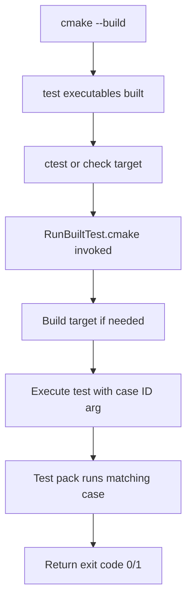

# TPBench Unit Testing Guide

This document guides developers through adding new unit tests to the TPBench framework, including creating mock implementations, updating CMake configuration, and running tests.

## 1 Test Architecture Overview

### 1.1 Directory Structure

```
tests/
├── CMakeLists.txt              # Root test configuration
├── RunBuiltTest.cmake          # Helper script for building and running tests
├── corelib/                    # Core library unit tests
│   ├── CMakeLists.txt          # Corelib test build config
│   ├── tpb_run_fli.c           # Test pack A1: FLI kernel runner tests
│   ├── tpb_run_pli.c           # Test pack A2: PLI kernel runner tests
│   ├── mock_kernel.c/.h        # Mock kernel implementations
│   ├── mock_timer.c/.h         # Mock timer implementation
│   └── mock_dynloader.c        # Mock dynamic loader (for PLI tests)
└── tpbcli/                     # CLI unit tests
    ├── CMakeLists.txt          # tpbcli test build config
    └── test-cli-run-dimargs.c  # Test pack B1: Dimension argument parsing tests
```

### 1.2 Test Organization

Tests are organized into **test packs**, each containing multiple **sub-cases**:

| Pack | Name | Description | Executable |
|------|------|-------------|------------|
| A1 | FLI Kernel Runner | Tests for `tpb_run_fli()` function | `test-tpb-run-fli` |
| A2 | PLI Kernel Runner | Tests for `tpb_run_pli()` function | `test-tpb-run-pli` |
| B1 | Dimension Arguments | Tests for dimension argument parsing | `test-cli-run-dimargs` |

Each sub-case has:
- **Case ID**: Unique identifier (e.g., `A1.1`, `A2.3`)
- **Case Name**: Human-readable label (e.g., `basic_success`, `null_handle`)
- **Test Function**: C function implementing the test logic

### 1.3 Test Execution Flow



## 2 Adding New Unit Tests

### 2.1 Step-by-Step Process

#### Step 1: Create Test Source File

Create a new test file in the appropriate directory (`tests/corelib/` or `tests/tpbcli/`). Follow this template:

```c
/*
 * <test_file>.c
 * Test pack <ID>: Brief description of what is tested.
 */

#include <stdio.h>
#include <stdlib.h>
#include <string.h>
#include "mock_kernel.h"  /* If using mock infrastructure */

static int g_setup_done = 0;

/* Optional: Setup function called before each test */
static int
ensure_setup(void)
{
    if (!g_setup_done) {
        int err = mock_setup_driver();
        if (err) {
            fprintf(stderr, "FATAL: setup failed with %d\n", err);
            return err;
        }
        g_setup_done = 1;
    }
    return 0;
}

/* <ID>.1: Test case description */
static int
test_case_name(void)
{
    if (ensure_setup()) return 1;

    /* Test logic here */
    /* Return 0 on pass, non-zero on failure */
    return (condition_met) ? 0 : 1;
}

/* Additional test cases... */

int
main(int argc, char **argv)
{
    const char *filter = (argc > 1) ? argv[1] : NULL;
    test_case_t cases[] = {
        { "<ID>.1", "case_name_1", test_case_name_1 },
        { "<ID>.2", "case_name_2", test_case_name_2 },
        /* ... */
    };
    int n = sizeof(cases) / sizeof(cases[0]);
    int fail = run_pack("<ID>", cases, n, filter);
    return (fail > 0) ? 1 : 0;
}
```

#### Step 2: Create Mock Implementations (If Needed)

For tests requiring mock objects, create header and implementation files in `tests/corelib/`:

**mock_<component>.h:**
```c
#ifndef MOCK_COMPONENT_H
#define MOCK_COMPONENT_H

#include "include/tpb-public.h"

/* Declare mock functions */
int mock_function(void);
void mock_set_value(int value);
int mock_get_value(void);

#endif /* MOCK_COMPONENT_H */
```

**mock_<component>.c:**
```c
#include <stdio.h>
#include "mock_component.h"

static int g_mock_value = 0;

int
mock_function(void)
{
    return TPBE_SUCCESS;
}

void
mock_set_value(int value)
{
    g_mock_value = value;
}

int
mock_get_value(void)
{
    return g_mock_value;
}
```

#### Step 3: Update CMakeLists.txt

For example, for compiling new tests, add the new test executable to `tests/corelib/CMakeLists.txt`:

```cmake
# Add new test executable
add_executable(test-<name> EXCLUDE_FROM_ALL
    <test_file>.c
    mock_kernel.c      # If needed
    mock_timer.c       # If needed
    mock_dynloader.c   # For PLI tests only
)

target_include_directories(test-<name> PRIVATE ${CMAKE_SOURCE_DIR}/src)
target_link_libraries(test-<name> PRIVATE tpbench m)

set_target_properties(test-<name> PROPERTIES
    RUNTIME_OUTPUT_DIRECTORY "${TPB_TEST_RUNTIME_OUTPUT_DIRECTORY}"
    LIBRARY_OUTPUT_DIRECTORY "${TPB_TEST_LIBRARY_OUTPUT_DIRECTORY}"
    ARCHIVE_OUTPUT_DIRECTORY "${TPB_TEST_ARCHIVE_OUTPUT_DIRECTORY}"
)

# Register sub-cases using the tpb_add_subcase macro
tpb_add_subcase(<ID> <ID>.1 case_name_1 test-<name> corelib)
tpb_add_subcase(<ID> <ID>.2 case_name_2 test-<name> corelib)

# Add to aggregate target (append to existing DEPENDS line)
add_custom_target(test_corelib
    DEPENDS test-tpb-run-fli test-tpb-run-pli test-<name>
)
```

#### Step 4: Update Root CMakeLists.txt (If Adding New Test Pack Aggregate)

If your new test pack needs to be included in the overall `check` target, update `tests/CMakeLists.txt`:

```cmake
add_custom_target(check
    COMMAND ${CMAKE_CTEST_COMMAND} --output-on-failure
    DEPENDS test_tpbcli test_corelib test_<new_pack>  # Add new target here
    USES_TERMINAL
)
```

### 2.2 Example: Adding a New FLI Test Case

Suppose you want to add test case `A1.7` that tests parameter validation in `tpb_run_fli`:

**In `tests/corelib/tpb_run_fli.c`:**
```c
/* A1.7: Kernel with invalid parameter type returns error */
static int
test_param_type_mismatch(void)
{
    if (ensure_setup()) return 1;

    tpb_k_rthdl_t hdl;
    int err = mock_build_handle("mock_fli_ok", &hdl);
    if (err) return 1;

    /* Corrupt parameter type to trigger validation error */
    hdl.argpack.args[0].ctrlbits = TPB_INT8_T;  /* Wrong type */

    err = tpb_run_fli(&hdl);
    tpb_driver_clean_handle(&hdl);
    free(hdl.argpack.args);
    return (err == TPBE_KERN_ARG_FAIL) ? 0 : 1;
}

/* In main(), add to cases array: */
{ "A1.7", "param_type_mismatch", test_param_type_mismatch },
```

**In `tests/corelib/CMakeLists.txt`:**
```cmake
tpb_add_subcase(A1 A1.7 param_type_mismatch test-tpb-run-fli corelib)
```

## 3 Mock Implementation Patterns

### 3.1 Mock Kernel Registration

The [`mock_kernel.c`](tests/corelib/mock_kernel.c:49) file demonstrates how to register mock kernels for testing:

```c
int
mock_setup_driver(void)
{
    int err;

    /* Set integration mode and timer */
    tpb_driver_set_integ_mode(0 /* TPB_INTEG_MODE_FLI */);
    tpb_driver_set_timer(mock_get_timer());

    /* Initialize kernel registry */
    err = tpb_register_kernel();
    if (err) return err;

    /* Enable kernel registration */
    tpb_driver_enable_kernel_reg();

    /* Register mock FLI kernel */
    err = tpb_k_register("mock_fli_ok", "Mock FLI success kernel", TPB_KTYPE_FLI);
    if (err) return err;
    err = tpb_k_add_parm("ntest", "Number of iterations", "10",
                         TPB_PARM_CLI | TPB_INT64_T | TPB_PARM_NOCHECK);
    if (err) return err;
    err = tpb_k_add_output("elapsed", "Elapsed time", TPB_INT64_T, TPB_UNIT_NS);
    if (err) return err;
    err = tpb_k_add_runner(mock_fli_success);
    if (err) return err;

    /* Register more mock kernels... */

    tpb_driver_disable_kernel_reg();
    return 0;
}
```

### 3.2 Mock Timer Implementation

The [`mock_timer.c`](tests/corelib/mock_timer.c:1) file provides a simple timer using `clock_gettime`:

```c
tpb_timer_t
mock_get_timer(void)
{
    tpb_timer_t t;
    snprintf(t.name, TPBM_NAME_STR_MAX_LEN, "mock_timer");
    t.unit = TPB_UNIT_NS;
    t.dtype = TPB_INT64_T;
    t.init = mock_timer_init;
    t.tick = mock_timer_tick;
    t.tock = mock_timer_tock;
    t.get_stamp = mock_timer_stamp;
    return t;
}
```

### 3.3 Mock Dynamic Loader (ELF Symbol Interposition)

For PLI kernel tests, [`mock_dynloader.c`](tests/corelib/mock_dynloader.c:1) uses ELF symbol interposition to override functions from `libtpbench.so`:

```c
/* Overrides tpb_dl_get_exec_path in libtpbench.so */
const char *
tpb_dl_get_exec_path(const char *kernel_name)
{
    (void)kernel_name;
    return g_mock_exec_path;  /* Set by mock_dl_set_exec_path() */
}

/* Overrides tpb_dl_is_complete in libtpbench.so */
int
tpb_dl_is_complete(const char *kernel_name)
{
    (void)kernel_name;
    return g_mock_complete;  /* Set by mock_dl_set_complete() */
}
```

**Key points:**
- These definitions are compiled into the test executable
- ELF linking gives priority to executable symbols over shared library symbols
- This allows `libtpbench.so` functions to call your mock implementations

### 3.4 Handle Builder Helper

The [`mock_build_handle()`](tests/corelib/mock_kernel.c:116) function simplifies creating runtime handles for tests:

```c
int
mock_build_handle(const char *kernel_name, tpb_k_rthdl_t *hdl)
{
    tpb_kernel_t *kern = NULL;

    if (hdl == NULL || kernel_name == NULL)
        return TPBE_NULLPTR_ARG;

    /* Query registered kernel (allocates isolated copy) */
    tpb_query_kernel(-1, kernel_name, &kern);
    if (kern == NULL)
        return TPBE_LIST_NOT_FOUND;

    /* Copy kernel metadata (transfers ownership of allocated data) */
    memset(hdl, 0, sizeof(tpb_k_rthdl_t));
    hdl->kernel = *kern;  /* struct copy - kern's pointers now owned by hdl->kernel */

    /* Free only the wrapper struct - the nested data is now owned by hdl->kernel.
     * Cannot use tpb_free_kernel(&kern) because that would free the transferred data. */
    free(kern);

    /* Initialize argument package with defaults (deep copy plims) */
    hdl->argpack.n = hdl->kernel.info.nparms;
    if (hdl->kernel.info.nparms > 0) {
        hdl->argpack.args = (tpb_rt_parm_t *)malloc(
            sizeof(tpb_rt_parm_t) * hdl->kernel.info.nparms);
        for (int i = 0; i < hdl->kernel.info.nparms; i++) {
            memcpy(&hdl->argpack.args[i], &hdl->kernel.info.parms[i],
                   sizeof(tpb_rt_parm_t));
            hdl->argpack.args[i].value = hdl->kernel.info.parms[i].default_value;
            /* Deep copy plims if present */
            if (hdl->kernel.info.parms[i].plims != NULL &&
                hdl->kernel.info.parms[i].nlims > 0) {
                hdl->argpack.args[i].plims = (tpb_parm_value_t *)malloc(
                    sizeof(tpb_parm_value_t) * hdl->kernel.info.parms[i].nlims);
                for (int j = 0; j < hdl->kernel.info.parms[i].nlims; j++) {
                    hdl->argpack.args[i].plims[j] =
                        hdl->kernel.info.parms[i].plims[j];
                }
            }
        }
    }

    /* Initialize other packages */
    hdl->respack.n = 0;
    hdl->respack.outputs = NULL;
    hdl->envpack.n = 0;
    hdl->envpack.envs = NULL;
    hdl->mpipack.mpiargs = NULL;

    return 0;
}
```

## 4 Running Tests

### 4.1 Build All Tests

```bash
# From build directory
cmake --build . --target test_corelib   # Build corelib tests only
cmake --build . --target test_tpbcli    # Build tpbcli tests only
cmake --build .                         # Build all (includes tests)
```

### 4.2 Run All Tests via CTest

```bash
# Run all registered tests
ctest --output-on-failure

# Run tests with specific label
ctest -L corelib      # Run only corelib tests
ctest -L tpbcli       # Run only tpbcli tests

# Verbose output
ctest -V
```

### 4.3 Run Tests via Custom Targets

```bash
# Use the check target (defined in tests/CMakeLists.txt)
cmake --build . --target check

# Or use pack-specific check targets
cmake --build . --target check_corelib
cmake --build . --target check_tpbcli
```

### 4.4 Run Individual Test Executables

```bash
# Run all cases in a test pack
./tests/bin/test-tpb-run-fli

# Run specific case by ID
./tests/bin/test-tpb-run-fli A1.1    # Run only basic_success
./tests/bin/test-tpb-run-pli A2.3    # Run only basic_success for PLI
```

### 4.5 Test Output Format

Each test outputs results in this format:

```
Running test pack A1 (6 cases)
------------------------------------------------------
[A1.1] basic_success                        PASS
[A1.2] null_handle                          PASS
[A1.3] empty_runner                         PASS
[A1.4] kernel_warn                          PASS
[A1.5] kernel_fail                          PASS
[A1.6] param_retrieval                      PASS
------------------------------------------------------
Pack A1: 6 passed, 0 failed
```

## 5 CMake Configuration Details

### 5.1 Key Variables

| Variable | Description |
|----------|-------------|
| `TPB_TEST_RUNTIME_OUTPUT_DIRECTORY` | Directory for test executables (`${CMAKE_BINARY_DIR}/tests/bin`) |
| `TPB_TEST_LIBRARY_OUTPUT_DIRECTORY` | Directory for test libraries (`${CMAKE_BINARY_DIR}/tests/lib`) |
| `TPB_TEST_ARCHIVE_OUTPUT_DIRECTORY` | Directory for static libs (`${CMAKE_BINARY_DIR}/tests/lib`) |

### 5.2 The tpb_add_subcase Macro

Defined in [`tests/corelib/CMakeLists.txt`](tests/corelib/CMakeLists.txt:21):

```cmake
macro(tpb_add_subcase _prefix _case_id _case_name _target _label)
    add_test(
        NAME "${_case_id}-${_case_name}"
        COMMAND ${CMAKE_COMMAND}
            -DBUILD_DIR=${CMAKE_BINARY_DIR}
            -DBUILD_TARGET=${_target}
            -DTEST_EXECUTABLE=$<TARGET_FILE:${_target}>
            -DTEST_ARGS=${_case_id}
            -P ${CMAKE_SOURCE_DIR}/tests/RunBuiltTest.cmake
    )
    set_tests_properties("${_case_id}-${_case_name}" PROPERTIES LABELS "${_label}")
endmacro()
```

**Parameters:**
- `_prefix`: CTest name prefix (e.g., "A1")
- `_case_id`: Case ID passed as argv[1] to test executable (e.g., "A1.1")
- `_case_name`: Human-readable label appended to CTest name (e.g., "basic_success")
- `_target`: CMake build target name for the test executable
- `_label`: CTest label for filtering (e.g., "corelib", "tpbcli")

### 5.3 RunBuiltTest.cmake Helper Script

The [`RunBuiltTest.cmake`](tests/RunBuiltTest.cmake:1) script ensures the test target is built before running:

```cmake
# Required variables: BUILD_DIR, BUILD_TARGET, TEST_EXECUTABLE

# Build target if needed
execute_process(
    COMMAND "${CMAKE_COMMAND}" --build "${BUILD_DIR}" --target "${BUILD_TARGET}"
    RESULT_VARIABLE build_result
)

if(NOT build_result EQUAL 0)
    message(FATAL_ERROR "Failed to build target ${BUILD_TARGET}")
endif()

# Run test executable with optional arguments
execute_process(
    COMMAND "${TEST_EXECUTABLE}" ${TEST_ARGS}
    RESULT_VARIABLE test_result
)

if(NOT test_result EQUAL 0)
    message(FATAL_ERROR "Test executable failed with exit code ${test_result}")
endif()
```

## 6 Best Practices

### 6.1 Test Naming Conventions

- **Pack IDs**: Use sequential letters/numbers (A1, A2, B1, ...)
- **Case IDs**: Use pack prefix + sequential number (A1.1, A1.2, ...)
- **Function names**: Use `test_<description>` format with underscores
- **Test files**: Use `<component>_test.c` or `test-<component>.c` format

### 6.2 Test Independence

Each test case should:
- Be independent of other tests (no shared state)
- Clean up allocated resources before returning
- Return 0 on success, non-zero on failure
- Print informative messages for debugging failures

### 6.3 Resource Cleanup

Always free allocated memory in tests:

```c
static int
test_example(void)
{
    tpb_k_rthdl_t hdl;
    int err = mock_build_handle("mock_kernel", &hdl);
    if (err) return 1;

    /* Test logic */
    err = tpb_run_fli(&hdl);

    /* Cleanup before returning */
    tpb_driver_clean_handle(&hdl);
    free(hdl.argpack.args);

    return (err == TPBE_SUCCESS) ? 0 : 1;
}
```

### 6.4 Using atexit for Teardown

For tests requiring cleanup of external resources (files, directories):

```c
static char g_temp_dir[512];

static void
cleanup_temp_files(void)
{
    unlink(g_temp_file);
    rmdir(g_temp_dir);
}

int
main(int argc, char **argv)
{
    atexit(cleanup_temp_files);  /* Register cleanup */
    /* ... test setup and execution ... */
}
```

## 7 Debugging Tests

### 7.1 Enable Verbose Output

```bash
# Run with ctest verbose mode
ctest -V -R A1.1

# Or run executable directly to see all output
./tests/bin/test-tpb-run-fli A1.1
```

### 7.2 Add Debug Prints

Add `printf` statements in test functions:

```c
static int
test_debug_example(void)
{
    printf("[DEBUG] Starting test...\n");

    tpb_k_rthdl_t hdl;
    int err = mock_build_handle("mock_fli_ok", &hdl);
    printf("[DEBUG] Handle build result: %d\n", err);
    if (err) return 1;

    /* More debug output... */

    return 0;
}
```

### 7.3 Use GDB for Debugging

```bash
# Run test executable in gdb
gdb ./tests/bin/test-tpb-run-fli -ex "run A1.1"

# Set breakpoint at specific test function
gdb ./tests/bin/test-tpb-run-fli -ex "break test_basic_success" -ex "run"
```

## 8 Reference Files

| File | Purpose |
|------|---------|
| [`tests/corelib/tpb_run_fli.c`](tests/corelib/tpb_run_fli.c:1) | Example FLI kernel runner tests (pack A1) |
| [`tests/corelib/tpb_run_pli.c`](tests/corelib/tpb_run_pli.c:1) | Example PLI kernel runner tests (pack A2) |
| [`tests/corelib/mock_kernel.c`](tests/corelib/mock_kernel.c:1) | Mock kernel registration and handle builder |
| [`tests/corelib/mock_timer.c`](tests/corelib/mock_timer.c:1) | Mock timer implementation |
| [`tests/corelib/mock_dynloader.c`](tests/corelib/mock_dynloader.c:1) | ELF symbol interposition for PLI tests |
| [`tests/tpbcli/test-cli-run-dimargs.c`](tests/tpbcli/test-cli-run-dimargs.c:1) | CLI dimension argument parsing tests (pack B1) |
| [`tests/corelib/CMakeLists.txt`](tests/corelib/CMakeLists.txt:1) | Corelib test build configuration |
| [`tests/tpbcli/CMakeLists.txt`](tests/tpbcli/CMakeLists.txt:1) | tpbcli test build configuration |
| [`tests/RunBuiltTest.cmake`](tests/RunBuiltTest.cmake:1) | Helper script for CTest integration |
